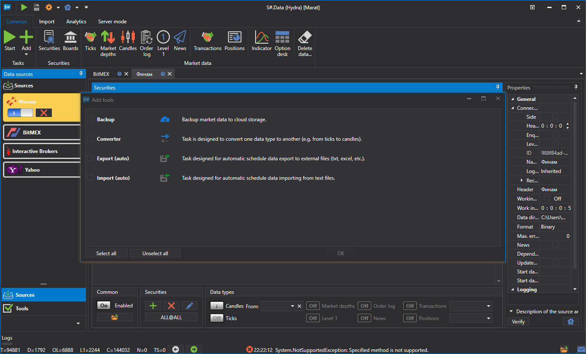

# Tasks

The tool is a repeating action at a specific time.

To view the list of tools, select the **Tools** item in the left pane. Work with tools is the same as with sources \- the tool can be added, deleted, edited, enabled\/disabled. To add the **Tool**, on the **Common** tab, select **Add \=\> Tools**. A corresponding window will appear on which you can select the required **Tool**... 

Currently, there are four classes of tasks in [Hydra](../hydra.md)

- [Import (auto)](tasks/import_auto.md) \- the task is to import data from CSV format. 
- [Converter](tasks/converter.md) \- the task is to convert the exchange data to the ticks, candles or order books. 
- [Export (auto)](tasks/export_auto.md) \- the task is to export candles to different formats. 
- [Backup](misc/backup.md) \- the task is to backup data to the cloud service. 
