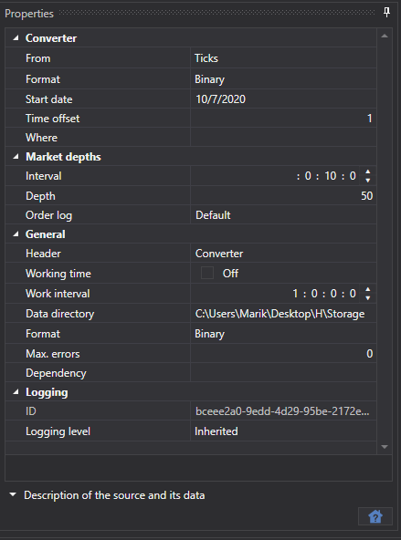
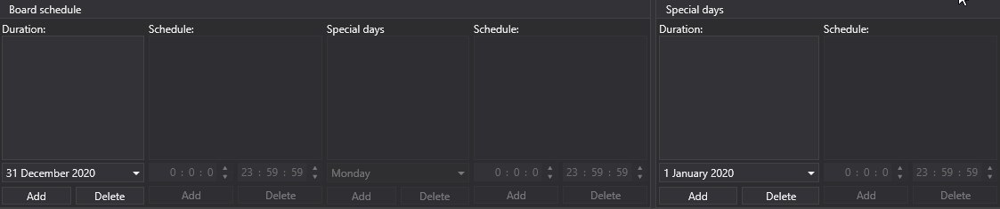
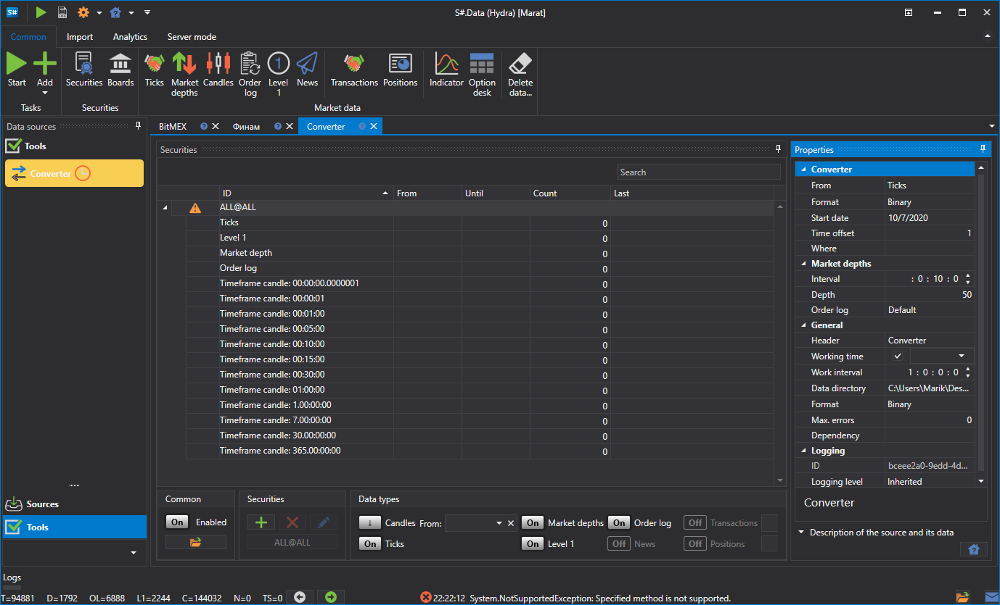
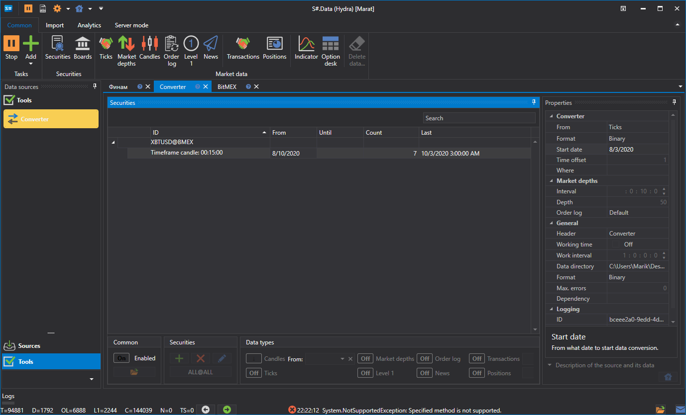
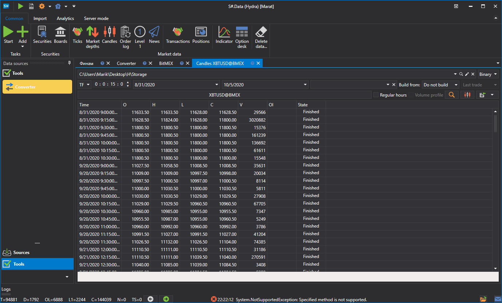

# Converter

The task converts exchange data. For example, from the Order Logs to ticks or from ticks to candles, etc.

**Converter**

- **Converter** \- converter. 
- **From** \- what data type will be converted. 
- **Data format** \- converted data format. 
- **Start date** \- from what date to start data conversion. 
- **Time offset** \- the time offset in days from the date the task was started. It is necessary to avoid converting data not for a full day. If real\-time data conversion is configured, there is a possibility that the data will not be converted over a full day due to the update interval settings. To avoid this, a time offset is set. 
- **Where** \- the data directory where the converted data will be saved. 

**Order books**

- **Interval** \- order book generation interval. 
- **Depth** \- maximum depth of order book generation. 
- **Order log** \- how to build order books from the order log. 

  Each exchange has its own **Order Log** format, the [Hydra](../../hydra.md) program supports three formats:
  - **By default** \- is used in most cases.
  - **ITCH** \- is used for the ITCH protocol (exchanges: LSE and Nasdaq).
  - **Plaza** \- used for the Moscow Exchange.

  

**General**

- **Header** \- Converter. 
- **Working hours** \- setting up the board work schedule. 
- **Interval of operation** \- the interval of operation. 
- **Data directory** \- data directory, from where the data for conversion will be received. 
- **Format** \- the converted data format: BIN\/CSV. 
- **Max. errors** \- the maximum number of errors, upon which the task will be stopped. By default, 0 \- the number of errors is ignored. 
- **Dependency** \- a task that must be performed before running the current one. 

**Logging**

- **Identifier** \- the identifier. 
- **Logging level** \- the logging level. 

Let's consider an example of data conversion.

1. Go to the **Converter** task. 
2. Select the instrument and in the window that appears, set the data type that we should receive during conversion, as well as the data type from which we should convert. For example, you need to convert Ticks into candles with a Time Frame of 15 minutes.

   > [!TIP]
   > IMPORTANT\! The period of data to be received should correspond to the period of data available for conversion, otherwise the data will not be converted. In the settings, it is important to specify the correct format of data to be converted, it is necessary that the format corresponds to the format of data to be converted. 
3. Specify the required directories. Time offset. Operation interval. 
4. We start the conversion.

It can be seen that the data has been converted. [Let's review](../working_with_data/view_and_export.md) the resulting data. 

This function is similar to [getting the required market data](../working_with_data/any_market_data_types.md) from another data type. 

**Watch [video tutorial](../videos/converter_task.md)**
