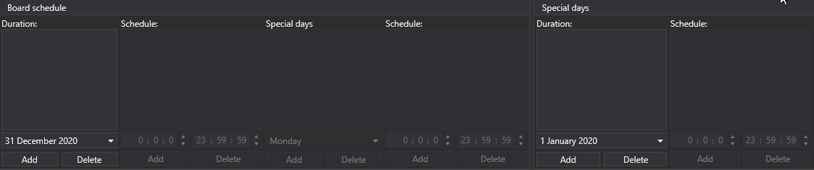

# Import (auto)

The task performs automatic import of exchange data from files in the specified directory according to the specified file mask.

For each selected market data type, the template is configured in the [Importing](../importing.md) tab.

At the bottom of the panel, you can select the instruments by which data will be imported, as well as the data type to import.

For each instrument, you can specify the following data import properties:

**Import (auto)**

**Settings**

- **Data type** \- type of imported data. 
- **Filename** \- full path to the file. 
- **Data directory** \- data directory. 
- **File mask** \- file mask that is used when scanning the directory. For example, candles\*.csv. 
- **Subdirectories** \- include subdirectories. 
- **Column separator** \- column separator. Tabulation is denoted by TAB. 
- **Indent from the beginning** \- the number of lines to skip from the beginning of file (if they contain meta information). 
- **Time zone** \- time zone. 
- **Interval** \- the frequency of data updates. 
- **Extended information** \- save extended imported fields in the extended information storage.
- **Duplicates** \- whether duplicate instruments need to be updated if they already exist. 
- **Ignore without ID** \- ignore instruments without an identifier. 

**General**

- **Header** \- Converter. 
- **Working hours** \- setting up the board work schedule. 
- **Interval of operation** \- the interval of operation. 
- **Data directory** \- data directory, from where the data for conversion will be received. 
- **Format** \- the converted data format: BIN\/CSV. 
- **Max. errors** \- the maximum number of errors, upon which the task will be stopped. By default, 0 \- the number of errors is ignored. 
- **Dependency** \- a task that must be performed before running the current one. 

**Logging**

- **Identifier** \- the identifier. 
- **Logging level** \- the logging level. 
