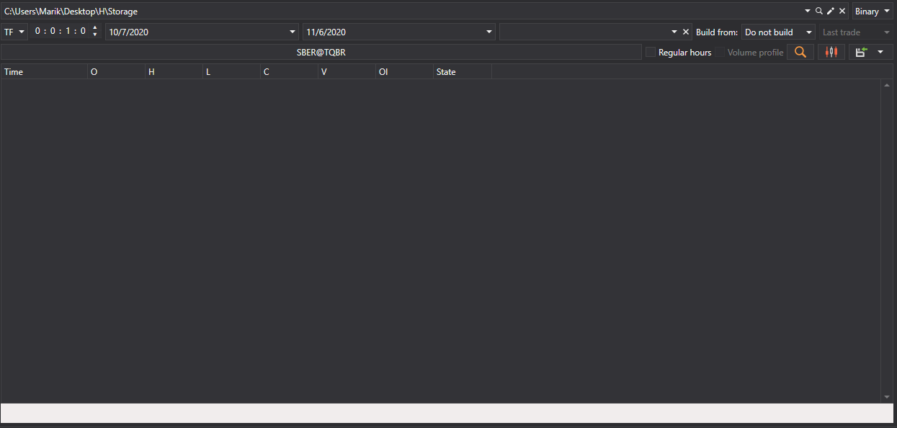
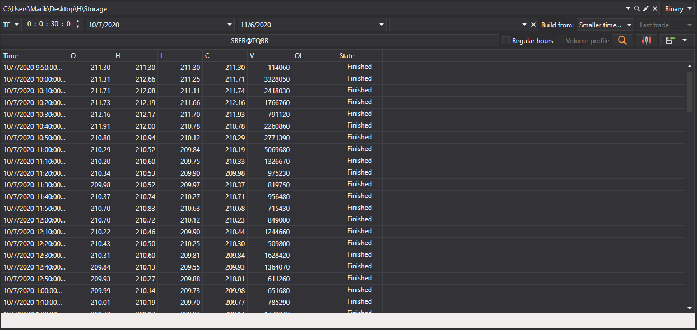
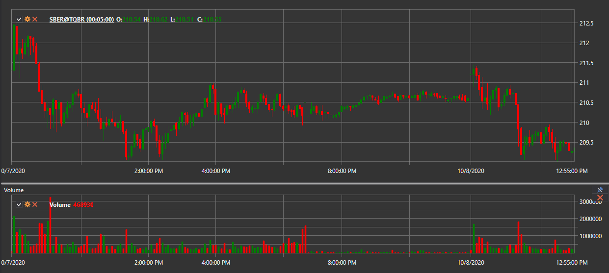
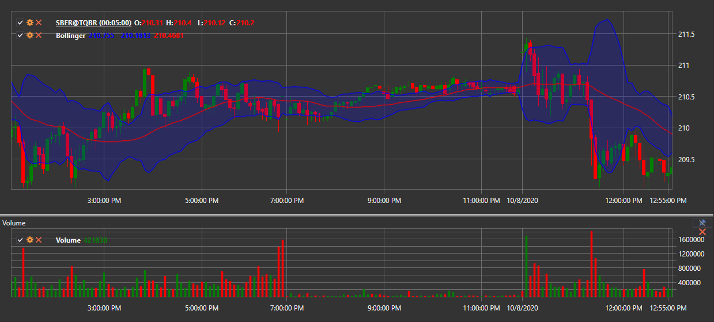

# Candle Generation

[Hydra](../../hydra.md) allows you to generate various types of candles based on downloaded trades, which can subsequently be exported to [Excel](https://en.wikipedia.org/wiki/Excel), XML, SQL, BIN, JSON, or TXT formats.

This allows you to use the generated data in any technical analysis programs (WealthLab, AmiBroker, etc.).

## Candle Generation Process

1. On the **General** tab, click the **Candles** button, and the following window will open:

   

2. In the opened window, you need to configure the candle generation parameters:

   - Select the desired candle type from the dropdown list (all [standard candle types](../../api/candles.md) are supported)
   - Specify the necessary parameters for the selected candle type:
     - For [TimeFrameCandleMessage](xref:StockSharp.Messages.TimeFrameCandleMessage) - select **Timeframe**
     - For [VolumeCandleMessage](xref:StockSharp.Messages.VolumeCandleMessage) - specify **Volume**
     - For [TickCandleMessage](xref:StockSharp.Messages.TickCandleMessage) - specify **Number of ticks**
     - For [RangeCandleMessage](xref:StockSharp.Messages.RangeCandleMessage) - specify **Range**
     - For [RenkoCandleMessage](xref:StockSharp.Messages.RenkoCandleMessage) - specify **Block size**
     - For [PnFCandleMessage](xref:StockSharp.Messages.PnFCandleMessage) - specify **P&F Parameters**
   - Select the instrument for which candles will be generated
   - Specify a time range (if necessary)
   - Click the  button to start generation

### Example of Timeframe Candle Generation

To generate 5-minute candles for the SBER@TQBR instrument:

1. Select the candle type [TimeFrameCandleMessage](xref:StockSharp.Messages.TimeFrameCandleMessage)
2. Set **Timeframe** = 5 min
3. Select the SBER@TQBR instrument
4. Click the search button

After data generation, you will see the result:

### Example of Volume Candle Generation

To generate volume candles:

1. Select the candle type [VolumeCandleMessage](xref:StockSharp.Messages.VolumeCandleMessage)
2. Specify the volume (for example, 100)
3. Select the instrument
4. In the **Build from** field, select **Ticks**
5. Click the search button

Generation result:

## Data Sources for Building Candles

If market data could not be obtained directly from the source, you can generate candles by selecting in the [**Build from**](any_market_data_types.md) field the type of data from which they will be built:

- **Ticks** - building candles from tick data
- **Order Books** - building candles from order book data
- **Level1** - building candles from Level1 data
- **Smaller Timeframe** - building candles with a larger timeframe from candles with a smaller one

### Examples of Different Building Options:

- 10-minute candles from ticks:

  

- 30-minute candles from 5-minute candles:

  

> [!TIP]
> If you select **don't build** in the **Build from** field, only ready-made candles that were downloaded directly through the data source will be searched.

## Visualization of Generated Candles

For graphical display of generated candles:

1. Click the  button
2. A chart with the built candles will open:

   

   

## Adding Indicators to the Chart

Technical indicators can be added to the candle chart:

1. Open the context menu by right-clicking on the chart panel
2. Select the **Indicator** item and the desired indicator from the list
3. To display the indicator on a separate panel:
   - Add a new panel using the  button
   - Select the desired indicator from the context menu

Example of a chart with added indicators:

## Data Export

The obtained candle values can be [exported to various formats](export_data.md) for use in other programs.

**Also see the [video tutorial](../videos/building_candles.md) on building various types of candles**