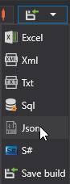

# Export into MetaStock

To export data to MetaStock format files, select the Txt format from the drop\-down list:



When exporting to text format (Txt) files, a window appears: 


In this window, specify the export template, where the curly brackets indicate the properties to export and their order:

```none
{SecurityId.SecurityCode},5,{OpenTime:yyyyMMdd},{OpenTime:HHmmss},{OpenPrice},{HighPrice},{LowPrice},{ClosePrice},{TotalVolume}
	  				
```

In the example, the five-minute candle timeframe is specified in the second position.

Also, the first line (Header) should be set in the file: 

```none
<TICKER>,<PER>,<DATE>,<TIME>,<OPEN>,<HIGH>,<LOW>,<CLOSE>,<VOL>
	  				
```
