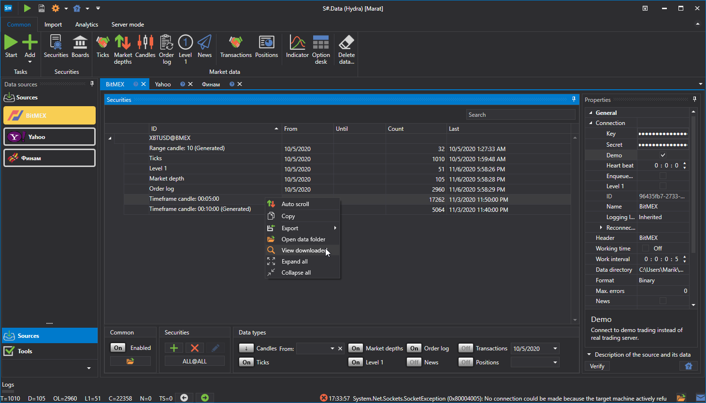
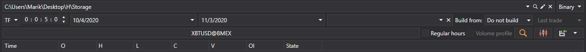
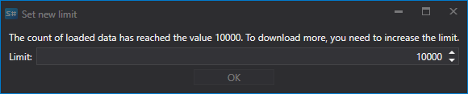
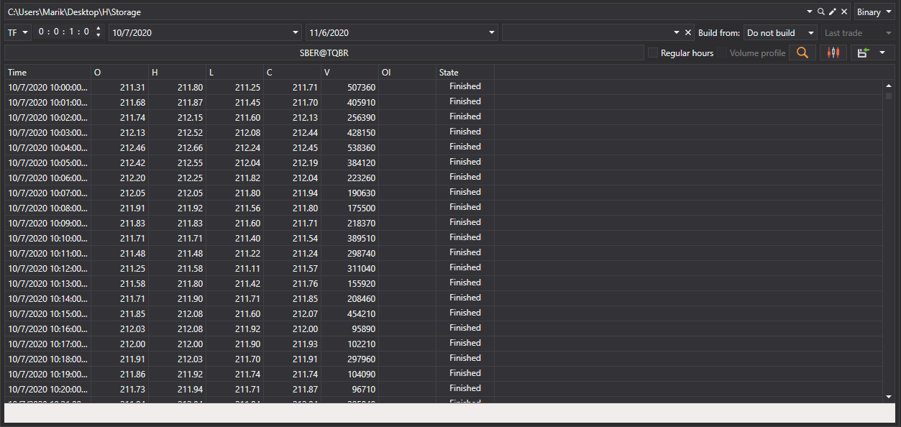
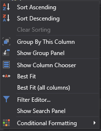

# View and export

The received [Hydra](../../hydra.md) data can be viewed in special panels. 

To do this, on the Common tab, click on one of the following buttons: [Ticks](view_and_export/ticks.md), [Order books](view_and_export/order_books.md), [Candles generation](candles_generation.md), [Order log](view_and_export/order_log.md), [Level 1 ](view_and_export/level_1_.md), [News](view_and_export/news.md), [Transactions](view_and_export/transactions.md), [Option desk](view_and_export/option_desk.md), [Indicators](view_and_export/indicators.md), [Positions](view_and_export/positions.md). 

Or right\-click on the required data type, as shown in the figure, as well as double\-clicking on the required data type.

Each panel contains a general interface of the settings as follows:

- The top line indicates the market data storage and its format (BIN or CSV).
- The bottom line sets the period for which the data will be requested. When you click the **Select security** button, the security selection window will appear, in which you can select one or several securities. If several securities are selected, then during the subsequent export to Excel or CSV, the program will automatically sort the data of different securities into different files. 
- If, when building a table with data, the amount of downloaded data exceeds the set limit, then a window will appear on the screen:

  It is necessary to increase the limit of downloaded data.
- If the data was received from sources whose time zone does not match the current time zone, then you can adjust the time zone. Then, after building, the received data will have the time of zone selected by the user. 
- Since a number of sources do not provide a possibility to download some data, the program provides the [Build from](any_market_data_types.md) field. Using this field, the user can build market data from another type of market data. The same function can be used to build market data without additional download, using already existing data as a basis. 
- After the above parameters are selected, you should click on the  button.

Using the context menu, you can configure various parameters of the table of market data values: row grouping, available columns, display format, etc.

