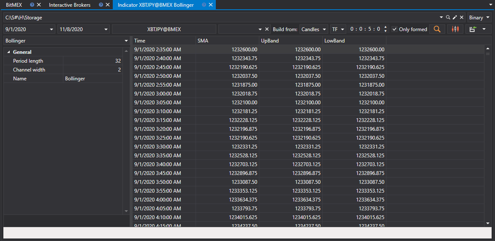
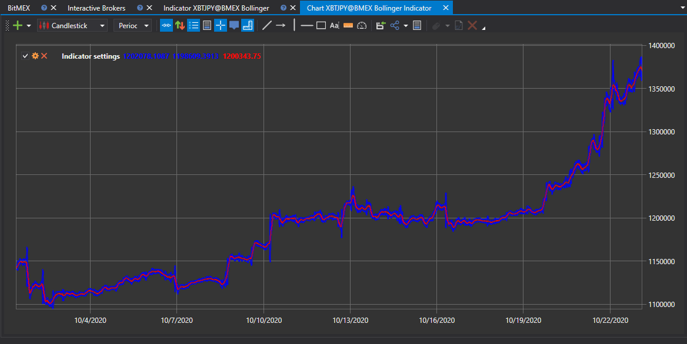

# Indicators

In the panel that appears, select the instrument, time range of interest, specify the data type from which the indicator will be built, set the [indicator](../../../api/indicators/list_of_indicators.md) and its parameters, and then click the  button: :

To view the chart of values, just click the  button.

The received values can be [exported to the required format](../export_data.md).
