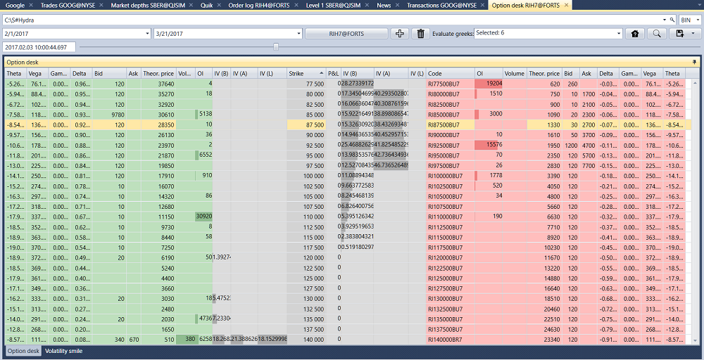
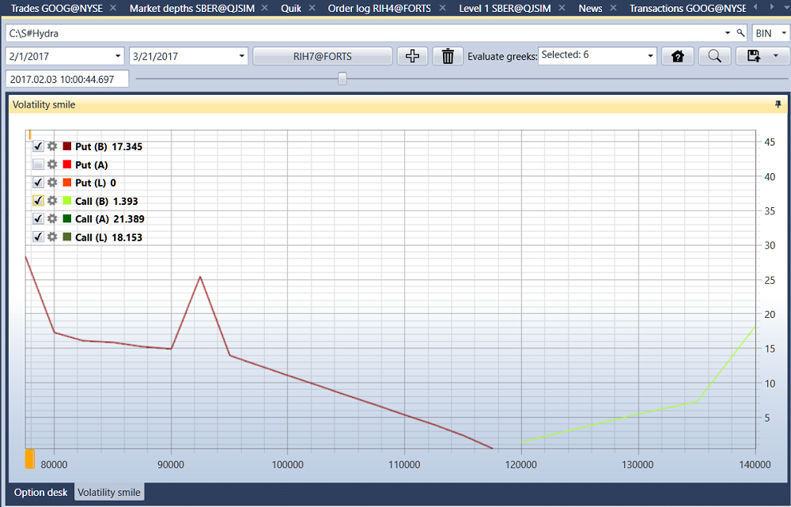
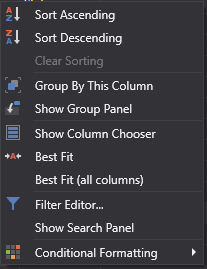

# Option desk

In the window that appears, select the desired time range, choose the underlying asset, add options for it, and click the  button:

If there is no history, but there is data on the spread, you can calculate the main Greeks (Delta, Gamma, Vega, Theta, Rho, Volatility (implied)), to do this you need to select them in the **Calculate Greeks** field. 

To view the **Volatility Smile**, you need to go to the **Volatility Smile** tab.

Using the context menu, you can configure the parameters of your own transactions table: grouping of rows, available columns, display format, etc.

The found transactions can be exported to the [Excel](https://en.wikipedia.org/wiki/Excel), xml, sql, bin or txt formats. This is done using the drop\-down list:

