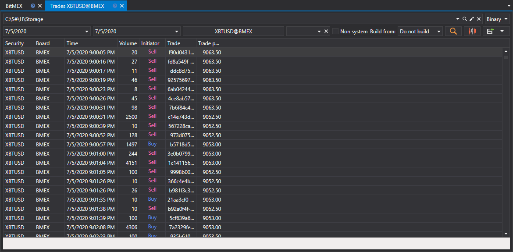

# Ticks

In the window that appears, select the securities, the required time interval and click the  button:

To unload non\-system trades, you should check the **Non\-system** box. 

The received values can be [exported to the required format](../export_data.md).
