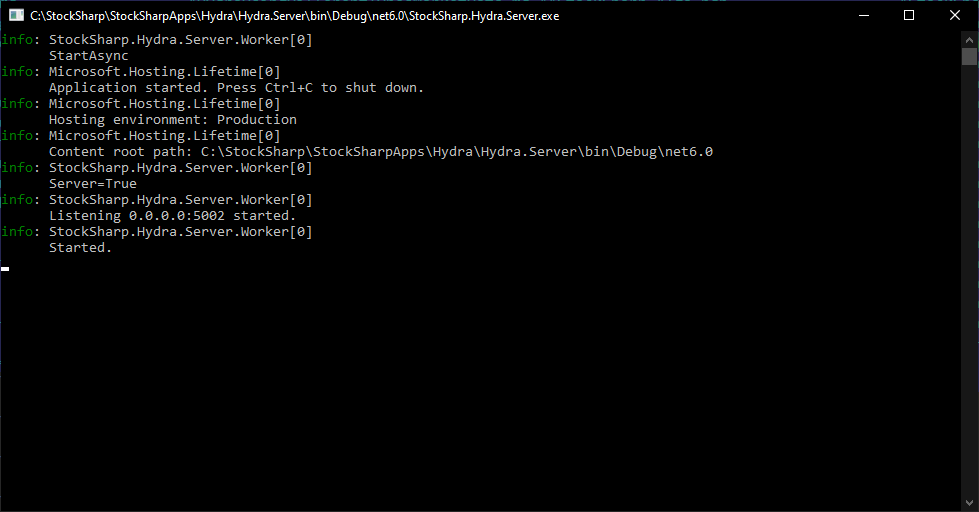

# Hydra Server

**Hydra Server** is a special service that can broadcast data over the network for connecting external programs (for example, [Designer](designer.md)).

Unlike [server mode](hydra/server_mode/settings.md), **Hydra Server** is a separate cross-platform program made as a console application and can be run on Windows or Linux servers.

> [!TIP]
> Under Windows, the program can be registered as a Windows Service and launched at computer startup. For more details about [services](https://en.wikipedia.org/wiki/Windows_service).

**Hydra Server** uses the same settings as [Hydra](hydra.md). Therefore, for initial setup, it is necessary to run the [Hydra](hydra.md) program and then use the settings created by the **Hydra Server** program.



The program has a configuration file `appsettings.json`:

```json
{
	"Logging": {
		"LogLevel": {
			"Default": "Information",
			"Microsoft.Hosting.Lifetime": "Information"
		}
	},
	"Server": {
		"WebApiAddress": "api.stocksharp.com/v1/",
		"LogLevel": "Inherit",
		"AutoDownload": false,
		"CompanyPath": "",
		"AppDataPath": ""
	}
}

```

- **WebApiAddress** - the address of StockSharp WebAPI. Used for management via [Telegram](telegram_services.md).
- **LogLevel** - the logging level.
- **AutoDownload** - whether to enable automatic downloading of sources at startup.
- **CompanyPath** - if using the program as a Windows Service, you need to set the path like "C:\\Users\\%user_name%\\Documents\\StockSharp".
- **AppDataPath** - in case of moving the settings directory of [Hydra](hydra.md), a new path to the settings must be specified.