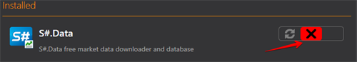

# Install  and remove apps

The [Installer](../installer.md) program allows you to select the application type to find the product you need.

To install the required application you need:

1. Select an application, click **Install**, agree to the license agreement and click **Continue**.
2. After that, you need to select the installation path. 

   **IMPORTANT\!** The folder into which the program will be installed must be empty. 

   Click **Continue**.
3. Select **Run** and wait for the installation to complete. 

After the installation is complete, the program is ready to use. 

To uninstall the program, select **Uninstall** and click the **Continue** button.

To restore, select **Restore** and click **Continue**.

**Watch [video tutorial](videos/install_and_remove_apps.md)**

## Recommended content

[Update apps](update_apps.md)
