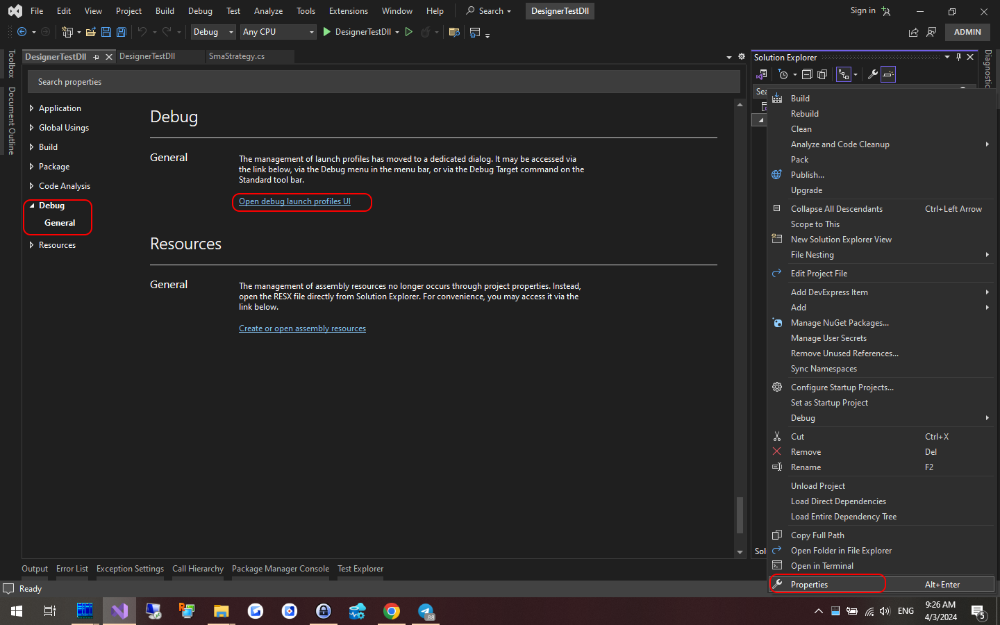
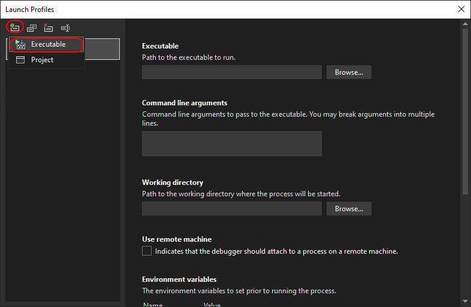
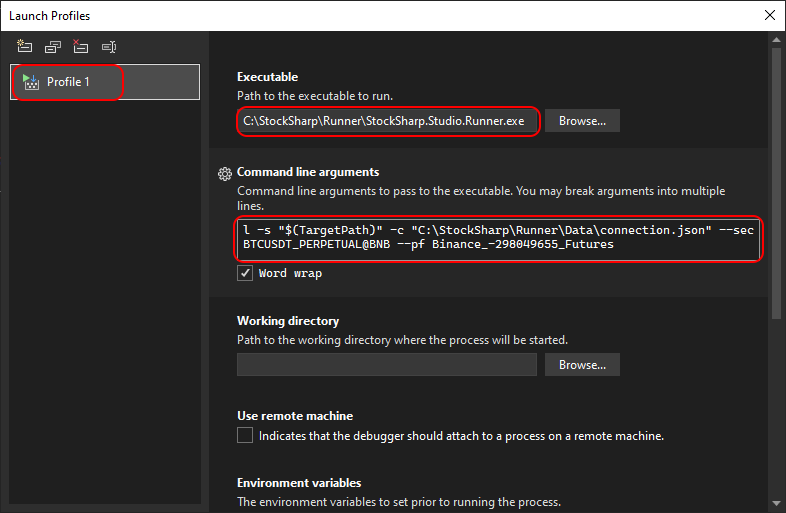
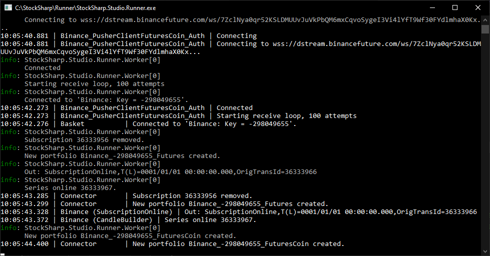
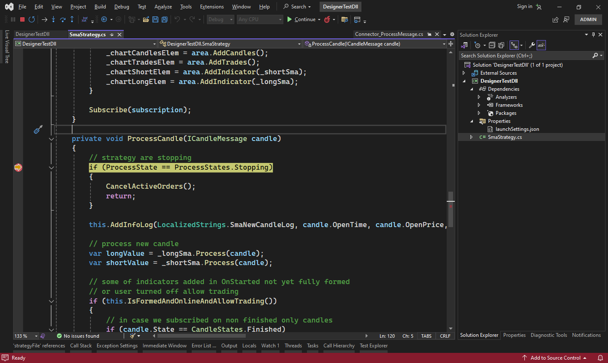

# Integration with Visual Studio

**Runner** can be used as a means of debugging strategies similarly to [Designer](../designer/strategies/using_dll/debug_dll_in_visual_studio.md). This is convenient if the strategy is planned to be run only in **Runner**. Otherwise, it is more convenient to launch and work with the strategy inside the [Designer](../designer.md) program.

To set up the debugging process, the following steps need to be taken:

1. Right-click on the trading strategy project and select **Properties** from the context menu:



In the tab that appears, find the **Debug** item, select the **General** section and click **Open debug launch profiles UI**.

2. Next, in the window that opens, create a new debugging profile with the launch of an external program:



3. Enter the full path to **Runner**, and specify the command line parameters for launching. More about [Runner's command line](command_line.md).



Command line arguments for the example:

```cmd
l -s "$(TargetPath)" -c "C:\StockSharp\Runner\Data\connection.json" --sec BTCUSDT_PERPETUAL@BNB --pf Binance_-298049655_Futures
```

$(TargetPath) - is a special **Visual Studio** macro that is automatically replaced with the path to the compiled DLL with the strategy during debugging launch.

4. Close the project settings window, and start the project debugging (for example, through F5). The **Runner** program window will appear, displaying the trading connection process:



5. When setting breakpoints, the program execution will stop upon reaching them. For example, to debug the trading logic when a new candle appears:

