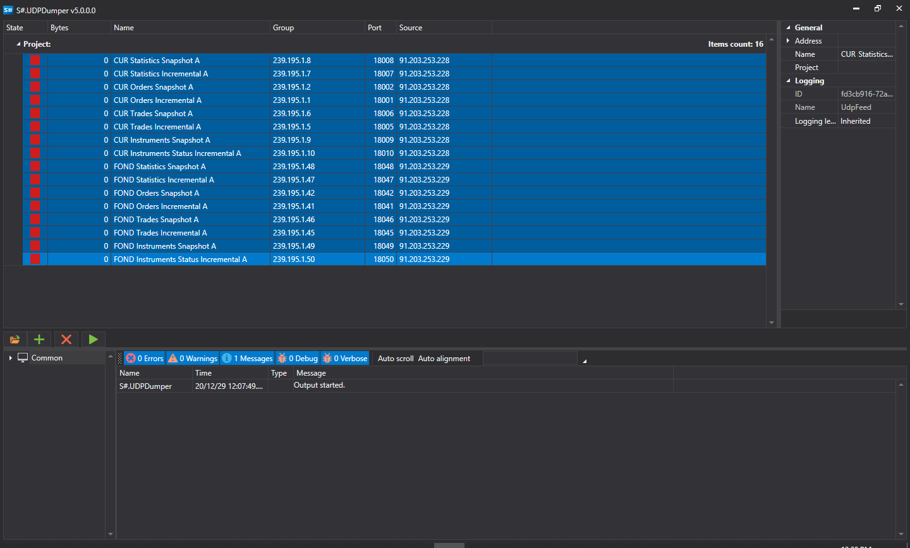

# UDP Dumper

**UDPDumper** records UDP packets. It can be used to verify network settings provided by a broker or exchange and to collect data for later testing of UDP-based connectors such as [FAST](api/connectors/common/fast_protocol.md) or SBE.

Install UDPDumper through [Installer](installer.md).

## Setup and run

1. On first launch, the app shows the following:
2. To add network feeds, either add them manually or load all feeds from exchange configuration files. To do this, click the button:
3. In the window that appears, you need to find the desired config file from the exchange and open it:
4. All feeds with IP addresses and ports settings will be loaded from a file:
5. Select the required feeds and click the start download button:
6. If the settings are correct, the program will start receiving UDP datagrams and writing them to disk. The app will show the number of bytes received for each feed:
7. **UDPDumper** has a graphical interface. If you need to run it without a graphical interface, for example on Linux, use **UDPDumper.Console**, the cross-platform console version.

   The app **UDPDumper.Console** takes as a parameter the path to the file created by the UI version (exactly the UI version, and **not an exchange config**):

   ```cs
   		StockSharp.UdpDumper.Console.exe settings.json
   		
   ```
8. To test a connector on the collected data, use dump mode. For details, see [Dump mode](api/connectors/common/fast_protocol/dump_mode.md).
