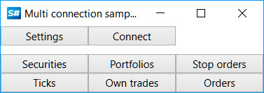
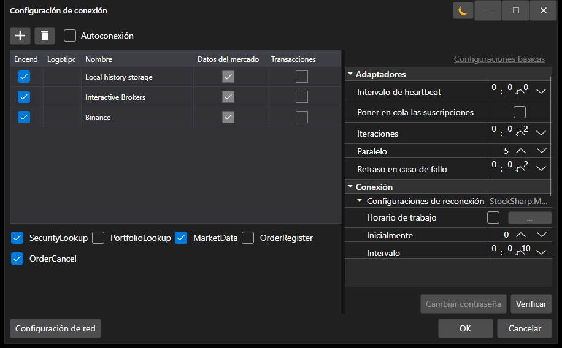

# Conectores

Para trabajar con bolsas y fuentes de datos en [S#](../api.md), se recomienda utilizar la clase base [Connector](xref:StockSharp.Algo.Connector).

Veamos cómo trabajar con [Connector](xref:StockSharp.Algo.Connector). El código fuente del ejemplo se puede encontrar en el proyecto Samples\/01\_Basic\/01\_ConnectAndDownloadInstruments.



Cree una instancia de la clase [Connector](xref:StockSharp.Algo.Connector):

```cs
...
public Connector Connector;
...
public MainWindow()
{
	InitializeComponent();
	Connector = new Connector();
	InitConnector();
}

```

Para configurar [Connector](xref:StockSharp.Algo.Connector), la **API** cuenta con una interfaz gráfica especial que permite configurar varias conexiones simultáneamente. Cómo utilizarla se describe en la sección [Configuración gráfica](connectors/graphical_configuration.md).

```cs
...
private readonly IFileSystem _fileSystem = Paths.FileSystem;
private const string _connectorFile = "ConnectorFile.json";
...
private void Setting_Click(object sender, RoutedEventArgs e)
{
	if (Connector.Configure(this))
	{
		Connector.Save().Serialize(_fileSystem, _connectorFile);
	}
}

```



De manera similar, puede agregar conexiones directamente desde el código (sin ventanas gráficas) utilizando el método de extensión [TraderHelper.AddAdapter\<TAdapter\>](xref:StockSharp.Algo.TraderHelper.AddAdapter``1(StockSharp.Algo.Connector,System.Action{``0}))**(**[StockSharp.Algo.Connector](xref:StockSharp.Algo.Connector) connector, [System.Action\<TAdapter\>](xref:System.Action`1) init **)**:

```cs
...
// Añadir adaptador para conectarse a Binance
connector.AddAdapter<BinanceMessageAdapter>(a =>
{
	a.Key = "<Su clave API>";
	a.Secret = "<Su clave secreta>";
});

// Añadir RSS para noticias
connector.AddAdapter<RssMessageAdapter>(a =>
{
	a.Address = "https://news-source.com/feed";
});

```

Puede agregar un número ilimitado de conexiones a un mismo objeto [Connector](xref:StockSharp.Algo.Connector). Por lo tanto, puede conectarse a múltiples bolsas y brokers simultáneamente desde el programa.

En el método *InitConnector*, configuramos los manejadores de eventos necesarios para [IConnector](xref:StockSharp.BusinessEntities.IConnector):

```cs
private void InitConnector()
{
	// Suscribirse al evento de conexión correcta
	Connector.Connected += () =>
	{
		this.GuiAsync(() => ChangeConnectStatus(true));
	};

	// Suscribirse al evento de error de conexión
	Connector.ConnectionError += error => this.GuiAsync(() =>
	{
		ChangeConnectStatus(false);
		MessageBox.Show(this, error.ToString(), LocalizedStrings.ErrorConnection);
	});

	// Suscribirse al evento de desconexión
	Connector.Disconnected += () => this.GuiAsync(() => ChangeConnectStatus(false));

	// Suscribirse al evento de error
	Connector.Error += error =>
		this.GuiAsync(() => MessageBox.Show(this, error.ToString(), LocalizedStrings.Str2955));

	// Suscribirse al evento de fallo de suscripción a datos de mercado
	Connector.SubscriptionFailed += (subscription, error, isSubscribe) =>
		this.GuiAsync(() => MessageBox.Show(this, error.ToString(),
			LocalizedStrings.Str2956Params.Put(subscription.DataType, subscription.SecurityId)));

	// Suscripciones para recibir datos

	// Instruments
	Connector.SecurityReceived += (sub, security) => _securitiesWindow.SecurityPicker.Securities.Add(security);

	// Operaciones tick
	Connector.TickTradeReceived += (sub, trade) => _tradesWindow.TradeGrid.Trades.TryAdd(trade);

	// Órdenes
	Connector.OrderReceived += (sub, order) => _ordersWindow.OrderGrid.Orders.TryAdd(order);

	// Operaciones propias
	Connector.OwnTradeReceived += (sub, trade) => _myTradesWindow.TradeGrid.Trades.TryAdd(trade);

	// Posiciones
	Connector.PositionReceived += (sub, position) => _portfoliosWindow.PortfolioGrid.Positions.TryAdd(position);

	// Fallos de registro de órdenes
	Connector.OrderRegisterFailReceived += (sub, fail) => _ordersWindow.OrderGrid.AddRegistrationFail(fail);

	// Fallos de cancelación de órdenes
	Connector.OrderCancelFailReceived += (sub, fail) => OrderFailed(fail);

	// Establecer proveedor de datos de mercado
	_securitiesWindow.SecurityPicker.MarketDataProvider = Connector;

	try
	{
		if (File.Exists(_connectorFile))
		{
			var ctx = new ContinueOnExceptionContext();
			ctx.Error += ex => ex.LogError();
			using (new Scope<ContinueOnExceptionContext>(ctx))
				Connector.Load(_connectorFile.Deserialize<SettingsStorage>(_fileSystem));
		}
	}
	catch
	{
	}

	ConfigManager.RegisterService<IExchangeInfoProvider>(new InMemoryExchangeInfoProvider());

	// Registrar proveedor de adaptadores para configuración gráfica
	ConfigManager.RegisterService<IMessageAdapterProvider>(
		new InMemoryMessageAdapterProvider(Connector.Adapter.InnerAdapters));
}
```

Cómo guardar y cargar la configuración de [Connector](xref:StockSharp.Algo.Connector) en un archivo se puede encontrar en la sección [Guardado y carga de configuración](connectors/save_and_load_settings.md).

La información sobre cómo crear su propio [Connector](xref:StockSharp.Algo.Connector) se puede encontrar en la sección [Creación de su Propio Conector](connectors/creating_own_connector.md).

La colocación de órdenes se describe en las secciones [Órdenes](orders_management.md), [Creación de una nueva orden](orders_management/create_new_order.md), [Creación de una nueva orden stop](orders_management/create_new_stop_order.md).

## Funcionalidades adicionales

### IFileSystem y Paths.FileSystem

Utilice `IFileSystem` para operaciones de archivo como la serialización y deserialización de configuraciones. La instancia predeterminada está disponible a través de `Paths.FileSystem`:

```cs
private readonly IFileSystem _fileSystem = Paths.FileSystem;
```

Los métodos `Serialize` y `Deserialize` sin el parámetro `IFileSystem` están marcados como `[Obsolete]`.

### Métodos asíncronos de órdenes

Los siguientes métodos asíncronos están disponibles para trabajar con órdenes:

- `RegisterOrderAsync`: registra una orden de forma asíncrona.
- `CancelOrderAsync`: cancela una orden de forma asíncrona.
- `EditOrderAsync`: edita una orden de forma asíncrona.

### SubscriptionsOnConnect

La propiedad `SubscriptionsOnConnect` controla las suscripciones que se realizan automáticamente al conectar. Por defecto, incluye suscripciones a instrumentos, portafolios y órdenes.

### Eventos del adaptador

Los siguientes eventos están disponibles para rastrear eventos de adaptadores específicos:

- `ConnectedEx`: un adaptador específico se ha conectado.
- `DisconnectedEx`: un adaptador específico se ha desconectado.
- `ConnectionErrorEx`: se produjo un error de conexión en un adaptador específico.

### Ciclo de vida de la suscripción

- `SubscriptionStarted`: la suscripción se ha iniciado.
- `SubscriptionOnline`: la suscripción ha pasado al estado en línea: se han recibido los datos históricos y ha comenzado la transmisión de datos en tiempo real.
- `SubscriptionFailed`: error de suscripción. El tercer parámetro, `isSubscribe`, indica si el error ocurrió durante la suscripción o la cancelación de la suscripción.
- `SubscriptionStopped`: la suscripción se ha detenido.

## Véase también

[Configuración gráfica](connectors/graphical_configuration.md)
