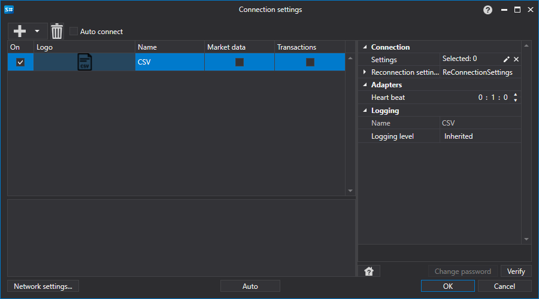

# Configuración gráfica de CSV

Para todos los productos [S#](../../../../api.md), la configuración gráfica de la conexión se realiza en la [ventana de configuración de conexión](../../../graphical_user_interface/connection_settings_window.md):

- **Settings** - Configuración de importación
- **Reconnection settings** - Mecanismo para el seguimiento de la conexión con el sistema de trading. ([Configuración de reconexión](../../reconnection_settings.md))
- **Heartbeat** - Intervalo de verificación del servidor para comprobar que la conexión está activa. Por defecto, es igual a 1 minuto.

## Contenido recomendado

[Conectores](../../../connectors.md)

[Configuración gráfica](../../graphical_configuration.md)

[Creación de un conector propio](../../creating_own_connector.md)

[Guardar y cargar la configuración](../../save_and_load_settings.md)
