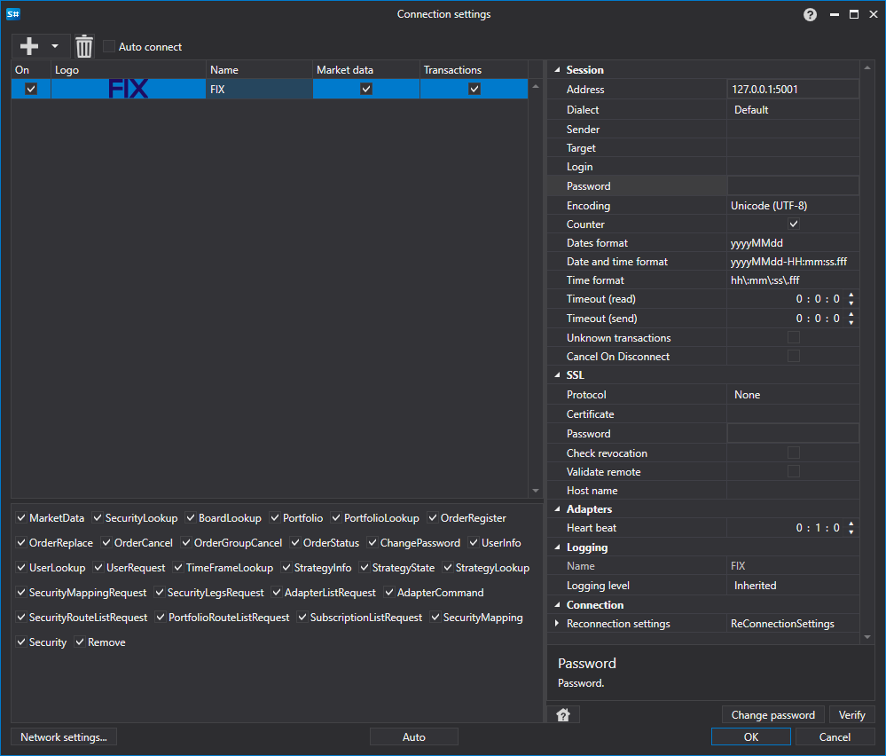

# Configuración gráfica FIX

Para todos los productos [S#](../../../../api.md), la configuración gráfica de la conexión se realiza en la [Ventana de configuración de conexión](../../../graphical_user_interface/connection_settings_window.md):

- **dirección** - Dirección.
- **Dialect** - Dialecto del protocolo FIX.
- **Sender** - Identificador del remitente.
- **Target** - Identificador del destinatario.
- **usuario** - Login.
- **contraseña** - Contraseña.
- **Portfolios** - Solicitar todos los portafolios al inicio.
- **Instruments** - Solicitar todos los instrumentos al conectar.
- **Encoding** - Codificación utilizada para la transferencia de datos.
- **Sequence reset** - Si se debe reiniciar el contador de identificadores.
- **Date format** - Formato de fecha.
- **Date and time format** - Formato de fecha y hora.
- **Time format** - Formato de hora.
- **Receive timeout** - Tiempo de espera de recepción de datos.
- **Send timeout** - Tiempo de espera de envío de datos.
- **Unknown transactions** - Procesar ejecuciones desconocidas generadas por un tercero.
- **Protocol** - Protocolo SSL para establecer la conexión.
- **certificado** - Certificado SSL.
- **contraseña** - Contraseña del certificado SSL.
- **Revocation check** - Verificación de revocación del certificado.
- **Check remote** - Verificar certificados remotos.
- **Server name** - Nombre del servidor que utiliza la conexión SSL.
- **Configuración de reconexión** - Configuración del mecanismo de seguimiento de la conexión con el sistema de trading ([Configuración de reconexión](../../reconnection_settings.md)).
- **Intervalo de comprobación** - Intervalo para notificar al servidor que la conexión sigue activa. El valor predeterminado es 1 minuto.
- **Unified board code** - Código de bolsa para el instrumento unificado.

## Vea también

[Conectores](../../../connectors.md)

[Configuración gráfica](../../graphical_configuration.md)

[Creación de un conector propio](../../creating_own_connector.md)

[Guardar y cargar configuración](../../save_and_load_settings.md)
