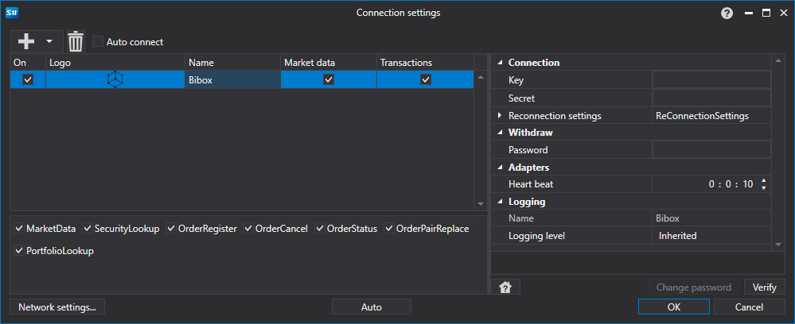

# Configuración gráfica Bibox

Para todos los productos [S#](../../../../api.md), la configuración gráfica de la conexión se realiza en la [Ventana de configuración de conexión](../../../graphical_user_interface/connection_settings_window.md):

- **Key** - Clave.
- **Secret** - Secreto.
- **Password** - Contraseña administrativa.
- **Heart beat** - Intervalo de verificación del servidor para comprobar que la conexión está activa. Por defecto es de 1 minuto.
- **Reconnection settings** - Mecanismo para el seguimiento de las conexiones con las configuraciones del sistema de trading. ([Configuración de reconexión](../../reconnection_settings.md))

## Contenido recomendado

[Conectores](../../../connectors.md)

[Configuración gráfica](../../graphical_configuration.md)

[Creación de un conector propio](../../creating_own_connector.md)

[Guardar y cargar configuraciones](../../save_and_load_settings.md)
