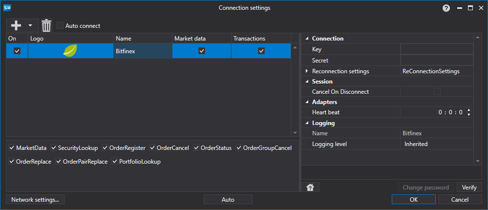

# Configuración gráfica Bitfinex

Para todos los productos [S#](../../../../api.md), la configuración gráfica de la conexión se realiza en la [Ventana de configuración de conexión](../../../graphical_user_interface/connection_settings_window.md):

- **Key** - Clave.
- **Secret** - Secreto.
- **Cancel On Disconnect** - Cancel On Disconnect.
- **Heart beat** - Intervalo de comprobación del servidor para verificar que la conexión está activa. Por defecto es igual a 1 minuto.
- **Reconnection settings** - Mecanismo para el seguimiento de las conexiones con la configuración del sistema de trading. ([Configuración de reconexión](../../reconnection_settings.md))

## Contenido recomendado

[Conectores](../../../connectors.md)

[Configuración gráfica](../../graphical_configuration.md)

[Creación de un conector propio](../../creating_own_connector.md)

[Guardar y cargar configuraciones](../../save_and_load_settings.md)
