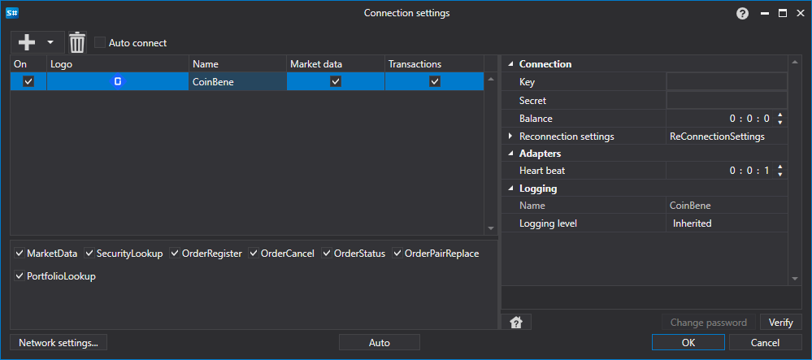

> [!WARNING]
> Este exchange ha cerrado permanentemente (~2021 — cierre). Este conector ya no está operativo. La documentación se conserva como referencia histórica.

# Configuración gráfica CoinBene

Para todos los productos de [S#](../../../../api.md), la configuración gráfica de la conexión se realiza en la [Ventana de configuración de conexión](../../../graphical_user_interface/connection_settings_window.md):

- **Key** - Clave.
- **Secret** - Secreto.
- **Balance** - Intervalo de verificación de balance. Requerido en caso de acciones de depósito y retiro.
- **Intervalo de comprobación** - Intervalo de verificación del servidor para rastrear que la conexión esté activa. Por defecto es igual a 1 minuto.
- **Configuración de reconexión** - Mecanismo para rastrear las conexiones con la configuración del sistema de trading. ([Configuración de reconexión](../../reconnection_settings.md))

## Contenido recomendado

[Conectores](../../../connectors.md)

[Configuración gráfica](../../graphical_configuration.md)

[Creación de su Propio Conector](../../creating_own_connector.md)

[Guardar y cargar configuración](../../save_and_load_settings.md)
