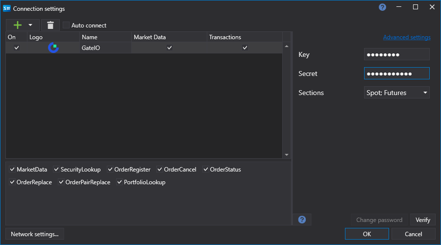

# Configuración gráfica de Gate.io

Para todos los productos [S#](../../../../api.md), la configuración gráfica de la conexión se realiza en la [Ventana de configuración de conexión](../../../graphical_user_interface/connection_settings_window.md):

- **clave** - Clave.
- **secreto** - Secreto.
- **Secciones** - Secciones de trading.
- **Demostración** - Conexión al trading demo.

## Ver también

[Conectores](../../../connectors.md)

[Configuración gráfica](../../graphical_configuration.md)

[Creación de un conector propio](../../creating_own_connector.md)

[Guardar y cargar la configuración](../../save_and_load_settings.md)
