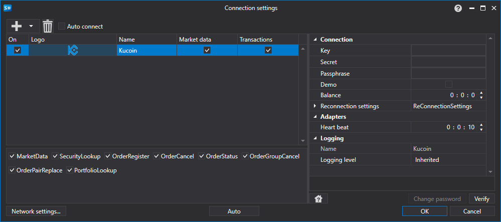

# Configuración gráfica Kucoin

Para todos los productos [S#](../../../../api.md), la configuración gráfica de la conexión se realiza en la [Ventana de configuración de conexión](../../../graphical_user_interface/connection_settings_window.md):

- **clave** - Clave.
- **secreto** - Secreto.
- **frase de acceso** - Frase de contraseña.
- **Demostración** - Conectarse al trading demo en lugar del servidor de trading real.
- **Saldo** - Intervalo de comprobación del balance. Necesario en caso de operaciones de depósito y retiro.
- **Intervalo de comprobación** - Intervalo de comprobación del servidor para rastrear si la conexión está activa. Por defecto es igual a 1 minuto.
- **Configuración de reconexión** - Mecanismo para rastrear las conexiones con la configuración del sistema de trading. ([Configuración de reconexión](../../reconnection_settings.md))

## Contenido recomendado

[Conectores](../../../connectors.md)

[Configuración gráfica](../../graphical_configuration.md)

[Creación de un conector propio](../../creating_own_connector.md)

[Guardar y cargar la configuración](../../save_and_load_settings.md)
