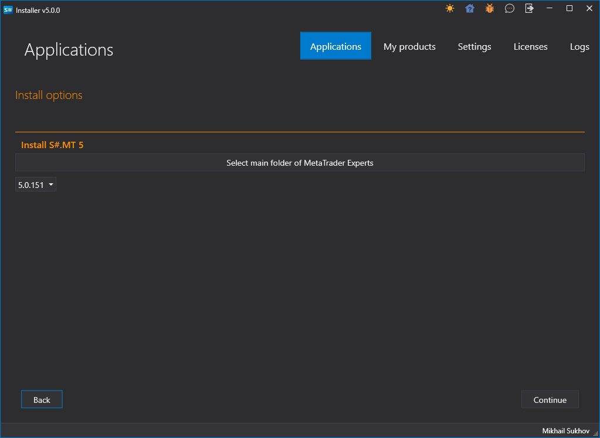
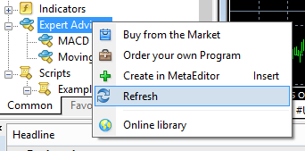
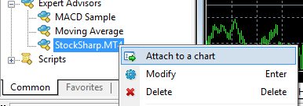

# MetaTrader

[StockSharp](../../../api.md) se integra con terminales MT4 y MT5 mediante conectores especiales. Para instalar estos conectores, use [Installer](../../../installer.md) (para más detalles, consulte [Instalación y eliminación de programas](../../../installer/install_and_remove_apps.md)).

Ambos conectores se usan de la misma manera, por lo que a continuación se describe el proceso de conexión a MT5:

## Configuración del conector MT

> [!Video https://www.youtube.com/embed/qGnIa7YIS5Q]

1. Seleccione el conector MT en [Installer](../../../installer.md) e inicie el proceso de instalación.

   

2. [Installer](../../../installer.md) preguntará en qué carpeta instalar el conector (debe instalarse en la carpeta Experts).

   

3. Si hay varios terminales instalados, debe elegir aquel en el que desea instalar el conector.

   

4. Después de seleccionar el terminal deseado, se mostrará la ruta a la carpeta Experts.

   

   > [!TIP]
   > - Si la ruta no puede determinarse automáticamente, debe seleccionarla manualmente mediante búsqueda de directorios *C:\\Users\\%su_usuario%\\AppData\\Roaming\\MetaQuotes\\Terminal\\%muchas_letras_y_numeros%\\MQL4\\Experts\\* (para MT5, la ruta incluirá MQL5).

5. Complete la instalación y espere a que finalice. Al final de la instalación, [Installer](../../../installer.md) advertirá que ahora debe configurar el terminal. Para ello, inicie el terminal MT y conéctese al trading.
6. En el menú Herramientas -> Opciones, seleccione la pestaña **Asesores expertos** y asegúrese de que el permiso para trading con DLL externas (**Permitir importaciones de DLL**) esté habilitado:
7. Si el terminal estaba ejecutándose durante la instalación del conector (paso 2), debe actualizar la lista de expertos haciendo clic derecho en Expertos y seleccionando **Actualizar** en el menú:

   

8. Seleccione el experto S#, haga clic derecho y elija **Adjuntar al gráfico** en el menú:

   

9. Aparecerá una ventana de configuración donde puede establecer el usuario y la contraseña (la autorización anónima está habilitada por defecto), así como la dirección de conexión (si se conecta a varios terminales a la vez, las direcciones deben contener puertos únicos).
10. Debe aparecer un icono de carita en la esquina superior derecha del gráfico (el primero encontrado):

    

    Además, en la ventana de registro del experto debe aparecer información sobre el inicio correcto del script y el número de instrumentos.
11. Si no se obtiene la licencia MT4 o MT5, aparecerá en el log una línea similar a la siguiente:

    

12. La conexión a MT se realiza mediante el protocolo FIX, usando el conector [Protocolo FIX](../common/fix_protocol.md). Para la demostración se utilizó el programa [Terminal](../../../terminal.md). A continuación se muestran los ajustes para la conexión transaccional y la conexión de datos de mercado (para MT5, el puerto predeterminado es 23001 en lugar de 23000):

    

    Deben hacerse ajustes similares en [Designer](../../../designer.md), [Hydra](../../../hydra.md) o cualquier programa API.

    El login y la contraseña se dejan vacíos en caso de autorización anónima (elemento anterior). Si se conecta a MT con varios robots, debe proporcionarse un login único para identificar las distintas conexiones.

    > [!TIP]
    > - El script debe iniciarse antes de conectar StockSharp a MetaTrader y mantenerse en ejecución mientras se necesite esta conexión.  
    > - Para ver velas históricas en StockSharp, deben descargarse desde el servidor MetaTrader. Lea cómo hacerlo en la documentación de MetaTrader.

    En caso de una conexión correcta, el ejemplo debe mostrar una lista de instrumentos y cuentas:

    

13. En caso de errores, se guardan logs del conector, disponibles en la carpeta **Experts\\StockSharp\\Data\\Log**:

    
