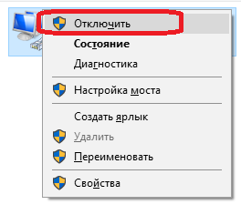

# Configuración de reconexión

Todos los conectores proporcionan la posibilidad de configurar la reconexión en caso de desconexión. En el elemento gráfico [Ventana de configuración de conexión](../graphical_user_interface/connection_settings_window.md), se ve así:


**Propiedades de reconexión**

- **Interval** - Intervalo con el que se realizarán los intentos de conexión.
- **Initially** - Número de intentos para establecer la conexión inicial si no se estableció (timeout, fallo de red, etc.).
- **Reconnection** - Número de intentos para reconectar si la conexión se interrumpió durante el funcionamiento.
- **Timeout** - Timeout para una conexión\/desconexión correcta.
- **Modo de operación** - Modo de operación durante el cual deben realizarse los intentos de conexión.

## Configuración de reconexión en código

El mecanismo de reconexión se configura mediante la propiedad [ReConnectionSettings](xref:StockSharp.Messages.IMessageAdapter.ReConnectionSettings) y permite controlar los siguientes escenarios de error:

- No se puede establecer una conexión (sin comunicación, usuario\/contraseña incorrectos, etc.). La propiedad [ReConnectionSettings.AttemptCount](xref:StockSharp.Messages.ReConnectionSettings.AttemptCount) establece el número de intentos para establecer una conexión. Por defecto es 0, lo que significa que el modo está deshabilitado. -1 significa un número infinito de intentos.
- La conexión se interrumpió durante el funcionamiento. La propiedad [ReConnectionSettings.ReAttemptCount](xref:StockSharp.Messages.ReConnectionSettings.ReAttemptCount) establece el número de intentos para reconectar la conexión. Por defecto es 100. -1 significa un número infinito de intentos. 0: el modo está deshabilitado.
- Al conectar o desconectar una conexión, los eventos correspondientes [IConnector.Connected](xref:StockSharp.BusinessEntities.IConnector.Connected) o [IConnector.Disconnected](xref:StockSharp.BusinessEntities.IConnector.Disconnected) pueden no recibirse durante mucho tiempo. Para estas situaciones, puede usar la propiedad [ReConnectionSettings.TimeOutInterval](xref:StockSharp.Messages.ReConnectionSettings.TimeOutInterval) para establecer el timeout máximo aceptable para un evento correcto. Si después de este tiempo no se produce el evento deseado, se genera el evento [IConnector.ConnectionError](xref:StockSharp.BusinessEntities.IConnector.ConnectionError) con un error de timeout.

1. Al crear un gateway, debe inicializar la configuración del mecanismo de reconexión mediante la propiedad [ReConnectionSettings](xref:StockSharp.Messages.IMessageAdapter.ReConnectionSettings):

   ```cs
   // inicializar el mecanismo de reconexión (se conectará automáticamente
   // cada 10 segundos si el gateway pierde la conexión con el servidor)
   Connector.Adapter.ReConnectionSettings.Interval = TimeSpan.FromSeconds(10);
   // la reconexión funcionará solo durante el horario de la bolsa seleccionada
   // (para desactivar la reconexión cuando normalmente no hay negociación, por ejemplo, por la noche)
   Connector.Adapter.ReConnectionSettings.WorkingTime = ExchangeBoard.Nasdaq.WorkingTime;
   ```
2. Para comprobar cómo funciona el mecanismo de control de conexión, puede desactivar la conexión a Internet:

   
3. A continuación se muestra el registro del programa, que indica que la aplicación inicialmente está conectada y que, después de desactivar la conexión a Internet, intenta reconectarse. Tras restaurar la conexión a Internet, la conexión de la aplicación se restablece:

   
4. Como pueden usarse varias conexiones en [Connector](xref:StockSharp.Algo.Connector), por defecto los eventos relacionados con la reconexión, como [ConnectionRestored](xref:StockSharp.Algo.Connector.ConnectionRestored), no se activan, y los adaptadores de conexión intentan reconectarse por sí mismos. Para que el evento empiece a generarse, debe establecer el valor de la propiedad [BasketMessageAdapter.SuppressReconnectingErrors](xref:StockSharp.Algo.BasketMessageAdapter.SuppressReconnectingErrors) del adaptador en **false**.

   ```cs
   Connector.Adapter.SuppressReconnectingErrors = false;
   Connector.ConnectionError += error => this.Sync(() => MessageBox.Show(this, "Conexión perdida"));
   Connector.ConnectionRestored += adapter => this.Sync(() => MessageBox.Show(this, "Conexión restaurada"));
   ```

   
