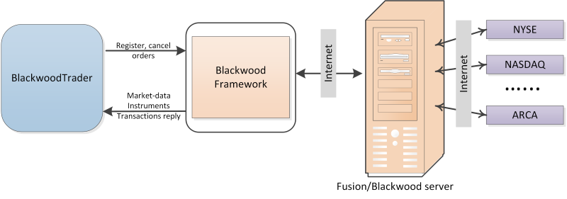

# Configuración Blackwood (Fusion)

Para trabajar con un conector, debe especificar **Login** y **Password**. **Login** y **Password** los proporciona el bróker. Para obtener acceso API, se recomienda contactar con el bróker.

El mecanismo de interacción se muestra en esta figura: 

