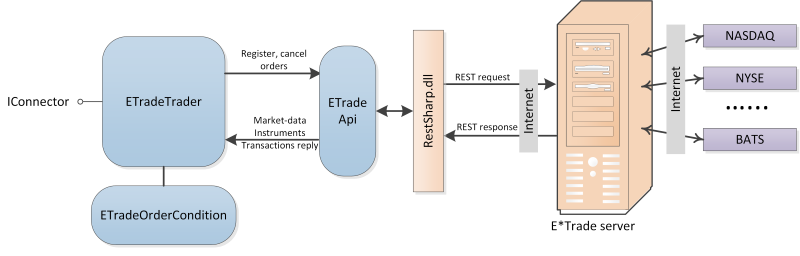
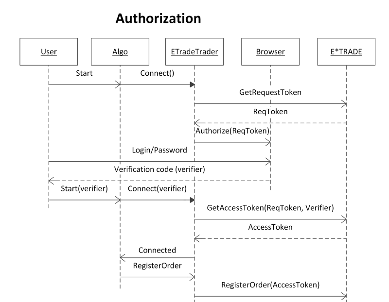

# Configuración E\*TRADE

Para trabajar con un conector, debe especificar **usuario** y **contraseña**. **usuario** y **contraseña** los proporciona el bróker. Para obtener acceso API, se recomienda contactar con el bróker.

El mecanismo de interacción se muestra en esta figura: 

[E\*TRADE](../e_trade.md) usa el protocolo de autorización OAuth 1.0a, que requiere login y contraseña mediante el navegador en el sitio [E\*TRADE](https://etrade.com/). La secuencia completa del procedimiento de autorización se muestra en la siguiente figura:

El procedimiento completo de autorización debe realizarse solo una vez al día (el servidor [E\*TRADE](../e_trade.md) restablece a medianoche EST los AccessTokens emitidos anteriormente). Si el procedimiento completo de autorización ya se realizó durante el día actual según EST, [ETradeMessageAdapter](xref:StockSharp.ETrade.ETradeMessageAdapter) descarga automáticamente el AccessToken almacenado en un subdirectorio del algoritmo [E\*TRADE](../e_trade.md).
