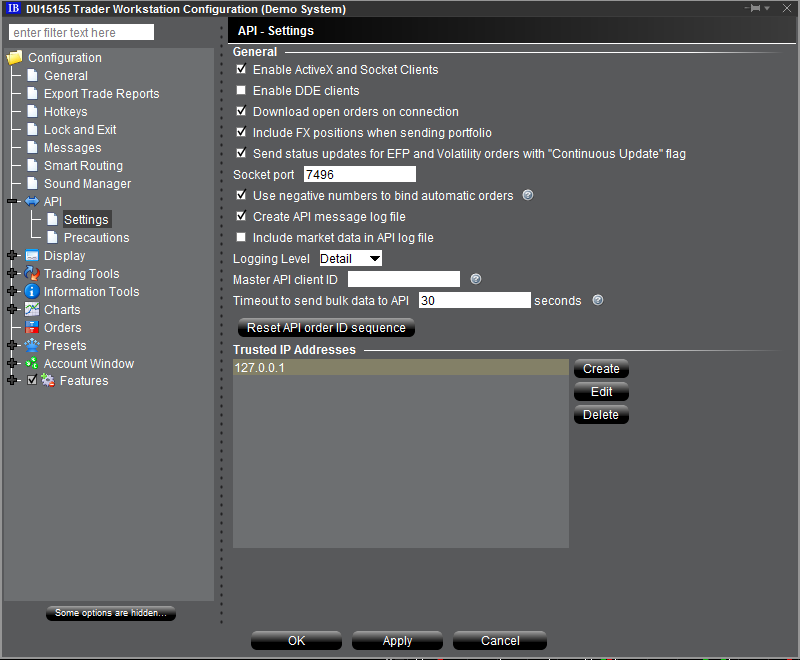

# Interactive Brokers

**Interactive Brokers** - plataforma de negociación para operar activos financieros, incluidos acciones, opciones, futuros, EFP, opciones sobre futuros, forex, bonos y fondos.

Antes de escribir robots de negociación para esta plataforma, lea los enlaces en [Conectores](../../connectors.md).

## Configuración de TWS Interactive Brokers

1. Debe permitir conexiones desde otros programas (por ejemplo, el algoritmo de negociación en [S#](../../../api.md)). Para ello, abra el menú de configuración "File -\> Global configuration...". Seleccione "Configuration -\> API -\> Settings" en la nueva ventana:

   
2. Active el modo "Enable ActiveX and Socket Clients".
3. Añada también la dirección del equipo que ejecutará el algoritmo (dirección local: 127.0.0.1). Esto elimina la necesidad de confirmar el permiso de conexión del terminal cada vez que inicia el algoritmo.

## Ver también

[Conectores](../../connectors.md)

[Configuración gráfica](../graphical_configuration.md)

[Guardar y cargar la configuración](../save_and_load_settings.md)

[Creación de un conector propio](../creating_own_connector.md)

[Gestión de órdenes](../../orders_management.md)

[Crear una nueva orden](../../orders_management/create_new_order.md)

[Crear una nueva orden stop](../../orders_management/create_new_stop_order.md)

[Inicialización del adaptador Interactive Brokers](interactive_brokers/adapter_initialization_interactive_brokers.md)
