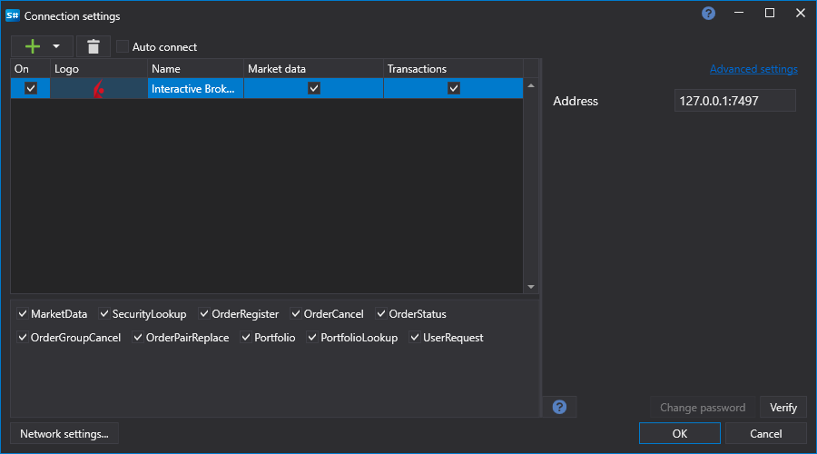

# Configuración gráfica Interactive Brokers

Para todos los productos [S#](../../../../api.md), la configuración gráfica de la conexión se realiza en la [Ventana de configuración de conexión](../../../graphical_user_interface/connection_settings_window.md):

- **dirección** - Dirección TWS.
- **Identifier** - ID único. Se usa cuando varios clientes están conectados a un terminal o gateway.
- **Real-time** - Si deben usarse datos en tiempo real o datos "congelados" en el servidor del bróker.
- **Nivel de registro** - Nivel de registro de mensajes del servidor.
- **Campos de datos de mercado** - Campos de datos de mercado que se recibirán con mensajes Level1 suscritos.
- **Protocol** - Protocolo SSL para establecer conexión
- **certificado** - Certificado SSL.
- **contraseña** - Contraseña del certificado SSL.
- **Comprobar revocación** - Comprobar revocación del certificado.
- **Validar certificados remotos** - Validar certificados remotos.
- **Nombre de host** - Nombre del servidor que comparte la conexión SSL.
- **MaxVersion** - MaxVersion
- **Intervalo de comprobación** - Intervalo de comprobación del servidor para rastrear si la conexión está activa. Por defecto es igual a 1 minuto.
- **Configuración de reconexión** - Mecanismo para rastrear las conexiones con la configuración del sistema de negociación. ([Configuración de reconexión](../../reconnection_settings.md))

## Contenido recomendado

[Conectores](../../../connectors.md)

[Configuración gráfica](../../graphical_configuration.md)

[Creación de un conector propio](../../creating_own_connector.md)

[Guardar y cargar la configuración](../../save_and_load_settings.md)
