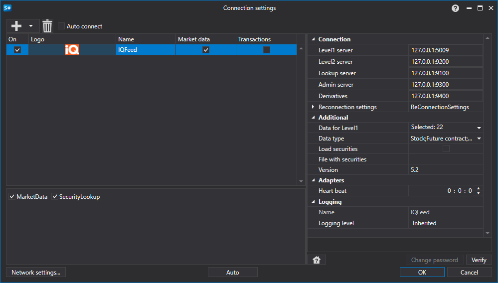

# Configuración gráfica IQFeed

Para todos los productos [S#](../../../../api.md), la configuración gráfica de la conexión se realiza en la [Ventana de configuración de conexión](../../../graphical_user_interface/connection_settings_window.md):

- **Servidor Level1** - Dirección para obtener datos de Level1.
- **Servidor Level2** - Dirección para obtener datos de Level2.
- **Servidor Lookup** - Dirección para obtener datos históricos.
- **Servidor Admin** - Dirección para obtener datos de servicio.
- **Derivados** - Dirección para obtener datos de derivados.
- **Datos de Level1** - Todos los tipos de datos de Level1 que deben transmitirse.
- **Tipo de datos** - Tipos de instrumentos para los que deben recibirse datos.
- **Cargar instrumentos** - Si debe cargarse todo el conjunto de instrumentos desde el archivo del sitio web de IQFeed.
- **Archivo con instrumentos** - Ruta al archivo con la lista de instrumentos de IQFeed descargada del sitio web. Si se especifica la ruta, no se realiza una segunda descarga desde el sitio web y solo se analiza la copia local.
- **Versión** - Versión.
- **Intervalo de comprobación** - Intervalo de comprobación del servidor para rastrear si la conexión está activa. Por defecto es igual a 1 minuto.
- **Configuración de reconexión** - Mecanismo para rastrear las conexiones con la configuración del sistema de trading. ([Configuración de reconexión](../../reconnection_settings.md))

## Contenido recomendado

[Conectores](../../../connectors.md)

[Configuración gráfica](../../graphical_configuration.md)

[Creación de un conector propio](../../creating_own_connector.md)

[Guardar y cargar la configuración](../../save_and_load_settings.md)
