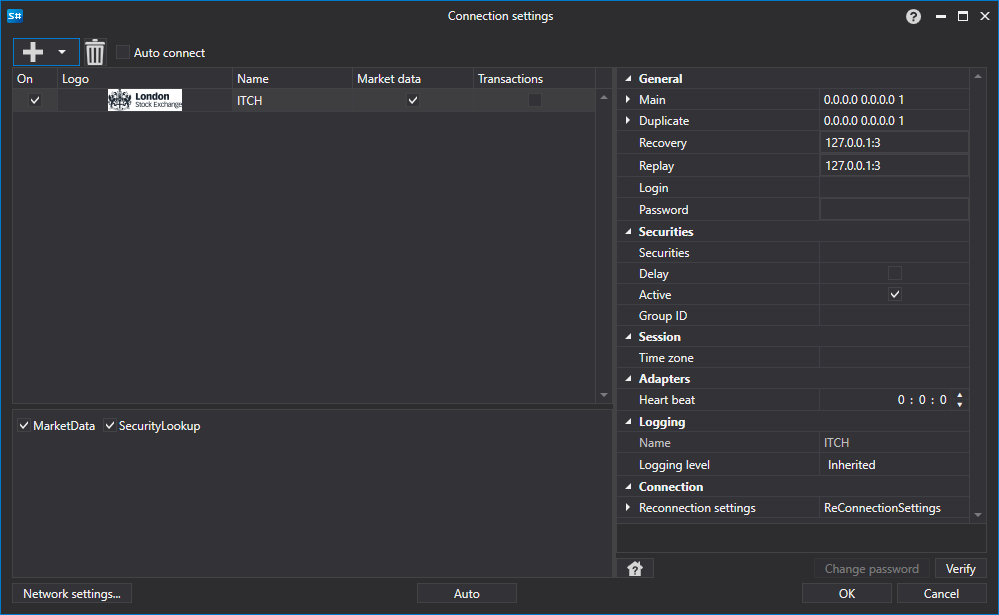

# Configuración gráfica ITCH

Para todos los productos [S#](../../../../api.md), la configuración gráfica de la conexión se realiza en la [Ventana de configuración de conexión](../../../graphical_user_interface/connection_settings_window.md):

- **Principal** - Grupo UDP principal.
- **Duplicado** - Grupo UDP duplicado.
- **Recuperación** - Servidor de recuperación.
- **Reproducción** - Servidor de replay.
- **usuario** - Usuario.
- **contraseña** - Contraseña.
- **Instrumentos** - Archivo con instrumentos.
- **Diferido** - Carga diferida de instrumentos.
- **Activo** - Solo instrumentos activos.
- **ID de grupo** - ID de grupo.
- **Zona horaria** - Información sobre la zona horaria donde se encuentra la bolsa.
- **Intervalo de comprobación** - Intervalo de comprobación del servidor para rastrear si la conexión está activa. Por defecto es igual a 1 minuto.
- **Configuración de reconexión** - Mecanismo para rastrear las conexiones con la configuración del sistema de negociación. ([Configuración de reconexión](../../reconnection_settings.md))

## Contenido recomendado

[Conectores](../../../connectors.md)

[Configuración gráfica](../../graphical_configuration.md)

[Creación de un conector propio](../../creating_own_connector.md)

[Guardar y cargar la configuración](../../save_and_load_settings.md)
