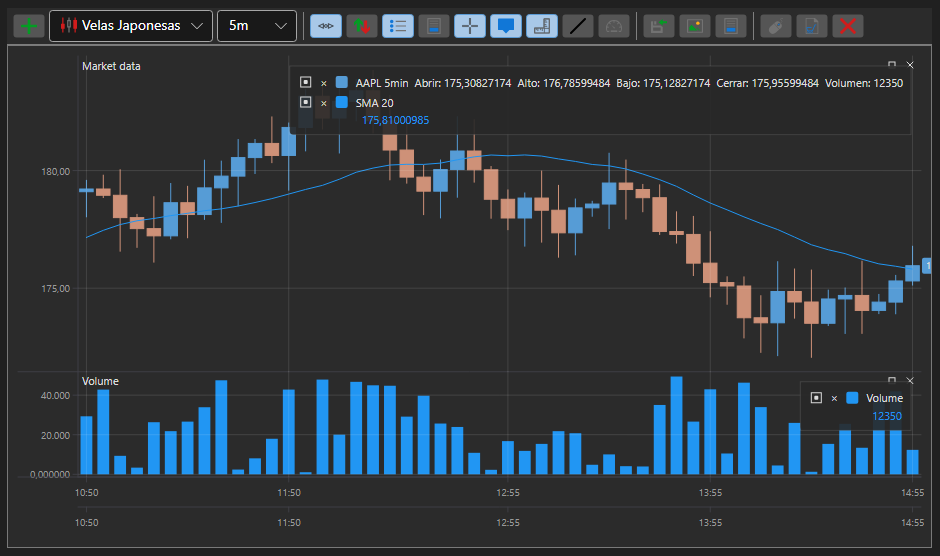

# Gráficos

[S#](../../api.md) proporciona componentes cómodos para crear gráficos. Estos componentes se agrupan en el espacio de nombres [StockSharp.Xaml.Charting](xref:StockSharp.Xaml.Charting).

El concepto clave de la biblioteca gráfica es la noción de *gráfico*. Un *gráfico* es un contenedor para otros elementos que se utilizan al construir gráficos. En [S#](../../api.md) hay varios tipos de *gráficos*:

- [Chart](xref:StockSharp.Xaml.Charting.Chart) - Componente gráfico para mostrar gráficos bursátiles.
- [ChartPanel](xref:StockSharp.Xaml.Charting.ChartPanel) - Componente gráfico avanzado para mostrar gráficos bursátiles.
- [EquityCurveChart](xref:StockSharp.Xaml.Charting.EquityCurveChart) - Componente gráfico para mostrar curvas de patrimonio.
- [BoxChart](charts/box_chart.md) - Gráfico que representa volúmenes como una cuadrícula de números.
- [ClusterChart](charts/cluster_chart.md) - Gráfico que muestra volúmenes como clústeres con histogramas.
- [OptionPositionChart](xref:StockSharp.Xaml.Charting.OptionPositionChart) - Componente gráfico que muestra posiciones de opciones y "griegas" respecto al activo subyacente. Consulte [OptionPositionChart](options/position_chart.md).

Además, [S#](../../api.md) incluye dos tipos de gráficos para el análisis de volumen: [BoxChart](charts/box_chart.md) y [ClusterChart](charts/cluster_chart.md).

La siguiente figura muestra los principales elementos del componente gráfico.

## Elementos del componente gráfico

## IChart

[IChart](xref:StockSharp.Charting.IChart) es la interfaz básica para todos los tipos de gráficos. Incluye métodos para agregar y quitar elementos "secundarios", propiedades para personalizar la apariencia y los métodos de dibujo del componente, así como un método para dibujar los propios gráficos. Un *gráfico* puede contener varias áreas ([IChartArea](xref:StockSharp.Charting.IChartArea)) para la representación (consulte la figura). [Chart](xref:StockSharp.Xaml.Charting.Chart) también incluye un área de vista previa *OverView* (consulte la figura). En esta área, puede seleccionar la zona de visualización del gráfico mediante controles deslizantes. Además, puede desplazar y escalar el gráfico arrastrando [IChartArea](xref:StockSharp.Charting.IChartArea), el eje X y con la rueda del ratón.

**Propiedades y métodos principales de [IChart](xref:StockSharp.Charting.IChart)**

- [IChart.Areas](xref:StockSharp.Charting.IChart.Areas) - Lista de áreas [IChartArea](xref:StockSharp.Charting.IChartArea).
- [IThemeableChart.ChartTheme](xref:StockSharp.Charting.IThemeableChart.ChartTheme) - Tema del componente.
- [IChart.IndicatorTypes](xref:StockSharp.Charting.IChart.IndicatorTypes) - Lista de indicadores que se pueden mostrar en el gráfico.
- [IChart.CrossHair](xref:StockSharp.Charting.IChart.CrossHair) - Habilitar/deshabilitar la visualización de la cruz.
- [IChart.CrossHairAxisLabels](xref:StockSharp.Charting.IChart.CrossHairAxisLabels) - Habilitar/deshabilitar la visualización de etiquetas de ejes en la cruz.
- [IChart.IsAutoRange](xref:StockSharp.Charting.IChart.IsAutoRange) - Habilitar/deshabilitar el escalado automático del eje X.
- [IChart.IsAutoScroll](xref:StockSharp.Charting.IChart.IsAutoScroll) - Habilitar/deshabilitar el desplazamiento automático en el eje X.
- [IChart.ShowLegend](xref:StockSharp.Charting.IChart.ShowLegend) - Habilitar/deshabilitar la visualización de la leyenda.
- [IChart.ShowOverview](xref:StockSharp.Charting.IChart.ShowOverview) - Habilitar/deshabilitar la visualización del área de vista previa *OverView*.
- [IChart.AddArea](xref:StockSharp.Charting.IChart.AddArea(StockSharp.Charting.IChartArea)) - Agregar un [IChartArea](xref:StockSharp.Charting.IChartArea).
- [IChart.AddElement](xref:StockSharp.Charting.IChart.AddElement(StockSharp.Charting.IChartArea, StockSharp.Charting.IChartElement)) - Agregar un elemento de serie de datos. Tiene varias sobrecargas.
- [IChart.Reset](xref:StockSharp.Charting.IChart.Reset(System.Collections.Generic.IEnumerable{StockSharp.Charting.IChartElement})) - "Restablecer" los valores dibujados anteriormente.
- [IChart.Draw](xref:StockSharp.Charting.IThemeableChart.Draw(StockSharp.Charting.IChartDrawData)) - Dibujar un valor en el gráfico.
- [IChart.OrderCreationMode](xref:StockSharp.Charting.IChart.OrderCreationMode) - Modo de creación de órdenes; cuando se establece, permite crear órdenes desde el gráfico. De forma predeterminada está desactivado.

## IChartArea

[IChartArea](xref:StockSharp.Charting.IChartArea) - Área de representación del gráfico; actúa como contenedor para [IChartElement](xref:StockSharp.Charting.IChartElement) (indicadores, velas, etc.) que se renderizan en el gráfico, y para los ejes del gráfico ([IChartAxis](xref:StockSharp.Charting.IChartAxis)).

**Propiedades principales de [IChartArea](xref:StockSharp.Charting.IChartArea)**

- [IChartArea.Elements](xref:StockSharp.Charting.IChartArea.Elements) - Lista de [IChartElement](xref:StockSharp.Charting.IChartElement).
- [IChartArea.XAxises](xref:StockSharp.Charting.IChartArea.XAxises) - Lista de ejes horizontales.
- [IChartArea.YAxises](xref:StockSharp.Charting.IChartArea.YAxises) - Lista de ejes verticales.

## IChartElement

Todos los elementos mostrados en el gráfico deben implementar la interfaz [IChartElement](xref:StockSharp.Charting.IChartElement). En [S#](../../api.md), las siguientes clases implementan esta interfaz:

- [ChartCandleElement](xref:StockSharp.Xaml.Charting.ChartCandleElement) - Elemento para mostrar velas.
- [ChartIndicatorElement](xref:StockSharp.Xaml.Charting.ChartIndicatorElement) - Elemento para mostrar indicadores.
- [ChartOrderElement](xref:StockSharp.Xaml.Charting.ChartOrderElement) - Elemento para mostrar órdenes.
- [ChartTradeElement](xref:StockSharp.Xaml.Charting.ChartTradeElement) - Elemento para mostrar operaciones.

Las clases de elementos visuales tienen varias propiedades para ajustar la apariencia del gráfico. Puede ajustar colores, grosor de línea y estilo de los elementos. Por ejemplo, mediante la propiedad [IChartCandleElement.DrawStyle](xref:StockSharp.Charting.IChartCandleElement.DrawStyle), puede cambiar la apariencia de la vela (vela o barra). Mediante la propiedad [ChartIndicatorElement.DrawStyle](xref:StockSharp.Xaml.Charting.ChartIndicatorElement.DrawStyle), puede establecer el estilo de la línea del indicador. Para mostrar el indicador como un histograma, use el valor [DrawStyles.Histogram](xref:Ecng.Drawing.DrawStyles.Histogram). Las propiedades [ChartCandleElement.ShowAxisMarker](xref:StockSharp.Xaml.Charting.ChartCandleElement.ShowAxisMarker) y [ChartIndicatorElement.ShowAxisMarker](xref:StockSharp.Xaml.Charting.ChartIndicatorElement.ShowAxisMarker) permiten activar/desactivar la visualización de marcadores (consulte la figura) en los ejes del gráfico.

## Véase también

- [Gráfico de velas](charts/candle_chart.md)
- [Panel de gráficos](charts/candle_chart_panel.md)
- [Gráfico de curva de patrimonio](charts/equity_curve_chart.md)
- [Gráficos Box](charts/box_chart.md)
- [Clústeres](charts/cluster_chart.md)

