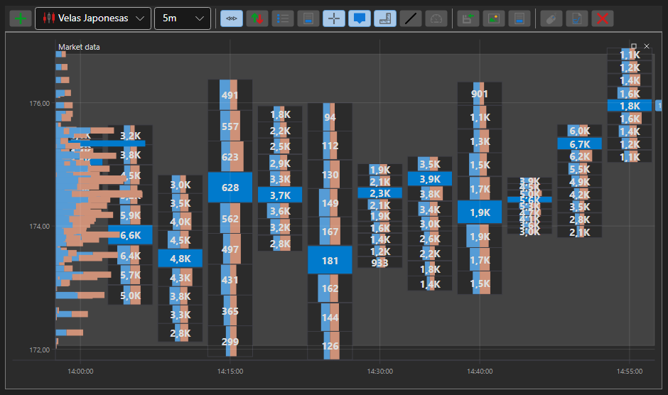

# Gráfico Box

BoxChart - es un tipo especial de gráfico para mostrar volúmenes en forma de cuadrícula de números. Para usar este tipo de gráfico, debe establecer el estilo especial [ChartCandleElement.DrawStyle](xref:StockSharp.Xaml.Charting.ChartCandleElement.DrawStyle) \= [ChartCandleDrawStyles.BoxVolume](xref:StockSharp.Charting.ChartCandleDrawStyles.BoxVolume). Este gráfico usa la información de la propiedad [PriceLevels](xref:StockSharp.Messages.CandleMessage.PriceLevels) como datos de origen.

**Propiedades principales**

- [ChartCandleElement.Timeframe2Multiplier](xref:StockSharp.Xaml.Charting.ChartCandleElement.Timeframe2Multiplier) - factor multiplicador que se aplica al marco temporal principal especificado en el constructor para obtener un segundo marco temporal. Las velas mostradas se unen en grupos de tamaño correspondiente al segundo marco temporal. Los grupos se dibujan en el gráfico mediante la cuadrícula y el marco de los colores correspondientes.
- [ChartCandleElement.Timeframe3Multiplier](xref:StockSharp.Xaml.Charting.ChartCandleElement.Timeframe3Multiplier) - funciona de forma similar a [ChartCandleElement.Timeframe2Multiplier](xref:StockSharp.Xaml.Charting.ChartCandleElement.Timeframe2Multiplier), pero para el tercer marco temporal. El tercer marco temporal se dibuja en el gráfico usando la cuadrícula del color correspondiente.
- [ChartCandleElement.FontColor](xref:StockSharp.Xaml.Charting.ChartCandleElement.FontColor) - color de los valores de volumen en el gráfico. 
- [ChartCandleElement.MaxVolumeColor](xref:StockSharp.Xaml.Charting.ChartCandleElement.MaxVolumeColor) - color de los valores de volumen en el gráfico para el volumen máximo de la vela especificada. 
- [ChartCandleElement.Timeframe2Color](xref:StockSharp.Xaml.Charting.ChartCandleElement.Timeframe2Color) - color de la cuadrícula del segundo marco temporal.
- [ChartCandleElement.Timeframe2FrameColor](xref:StockSharp.Xaml.Charting.ChartCandleElement.Timeframe2FrameColor) - color del marco del segundo marco temporal.
- [ChartCandleElement.Timeframe3Color](xref:StockSharp.Xaml.Charting.ChartCandleElement.Timeframe3Color) - color de la cuadrícula del tercer marco temporal.

Hay un ejemplo de uso de este tipo de gráfico en *Samples\/Common\/SampleChart*. 

> [!TIP]
> Para cambiar entre los tipos de gráfico, use el botón de configuración (engranaje), situado en la esquina superior izquierda del gráfico.
