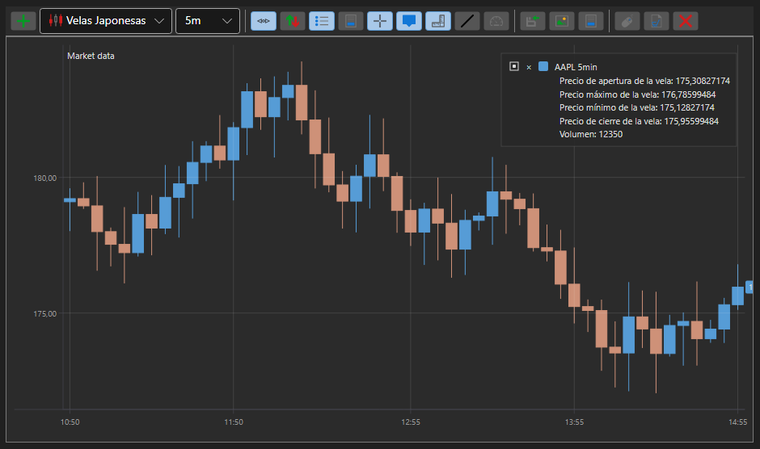

# Gráfico de velas

[Chart](xref:StockSharp.Xaml.Charting.Chart) es un componente gráfico que permite crear gráficos bursátiles: velas, indicadores, y mostrar marcadores de órdenes y operaciones en los gráficos.

A continuación se muestra un ejemplo de construcción de un gráfico usando el componente [Chart](xref:StockSharp.Xaml.Charting.Chart). El ejemplo se basa en Samples\/02\_Candles\/01\_Realtime, con algunas modificaciones.



## Ejemplo de construcción de un gráfico con Chart

1. En XAML, creamos una ventana y le agregamos el componente gráfico [Chart](xref:StockSharp.Xaml.Charting.Chart). Asignamos el nombre **Chart** al componente. Tenga en cuenta que al crear la ventana debe agregar el espacio de nombres *http:\/\/schemas.stocksharp.com\/xaml*.

   ```xaml
   <Window x:Class="SampleCandles.ChartWindow"
           xmlns="http://schemas.microsoft.com/winfx/2006/xaml/presentation"
           xmlns:x="http://schemas.microsoft.com/winfx/2006/xaml"
           xmlns:charting="http://schemas.stocksharp.com/xaml"
           Title="ChartWindow" Height="300" Width="300">
      <charting:Chart x:Name="Chart" x:FieldModifier="public" />
   </Window>
   ```

2. En el código de la ventana principal, declaramos variables para áreas del gráfico, elementos del gráfico, indicadores y suscripciones.

   ```cs
   private readonly Dictionary<Subscription, ChartWindow> _chartWindows = new Dictionary<Subscription, ChartWindow>();
   private readonly Connector _connector = new Connector();
   private readonly LogManager _logManager;
   private ChartArea _candlesArea;
   private ChartArea _indicatorsArea;
   private ChartIndicatorElement _smaChartElement;
   private ChartIndicatorElement _macdChartElement;
   private ChartCandleElement _candlesElem;
   private SimpleMovingAverage _sma;
   private MovingAverageConvergenceDivergence _macd;
   ```

3. En el manejador del evento **Click** del botón **Connect**, además de suscribirse a los eventos del conector y llamar al método [IConnector.Connect](xref:StockSharp.BusinessEntities.IConnector.Connect), nos suscribimos al evento [Connector.CandleReceived](xref:StockSharp.Algo.Connector.CandleReceived). En este manejador de eventos, el gráfico se dibujará cuando se reciba una nueva vela.

   ```cs
   private void ConnectClick(object sender, RoutedEventArgs e)
   {
       _connector.CandleReceived += OnCandleReceived;
       
       // Suscribirse a otros eventos necesarios
       _connector.Connected += () => this.GuiAsync(() => { /* Procesar conexión */ });
       _connector.Disconnected += () => this.GuiAsync(() => { /* Procesar desconexión */ });
       
       // Conectarse al sistema de trading
       _connector.Connect();
   }
   ```

4. En el manejador del botón **ShowChart**, creamos objetos de indicadores, áreas y elementos del gráfico. Agregamos elementos a las áreas y áreas al gráfico. Abrimos la ventana del gráfico e iniciamos una suscripción a velas.

   ```cs
   private void ShowChartClick(object sender, RoutedEventArgs e)
   {
       var security = SelectedSecurity;
       
       // Crear una suscripción a velas
       var subscription = new Subscription(
           DataType.TimeFrame(TimeSpan.FromMinutes(5)),
           security)
       {
           MarketData = 
           {
               // Solicitar datos históricos de 30 días
               From = DateTime.Today.Subtract(TimeSpan.FromDays(30)),
               To = DateTime.Now,
               // Obtener solo velas finalizadas
               IsFinishedOnly = true
           }
       };
       
       // Crear una ventana de gráfico
       _chartWindows.SafeAdd(subscription, key =>
       {
           var wnd = new ChartWindow
           {
               Title = $"{security.Code} {TimeSpan.FromMinutes(5)}"
           };
           wnd.MakeHideable();
           
           // Inicializar indicadores
           _sma = new SimpleMovingAverage() { Length = 11 };
           _macd = new MovingAverageConvergenceDivergence();
           
           // Inicializar elementos del gráfico
           _smaChartElement = new ChartIndicatorElement();
           _macdChartElement = new ChartIndicatorElement();
           _candlesElem = new ChartCandleElement();
           
           // Establecer el estilo de visualización de MACD como histograma
           _macdChartElement.DrawStyle = DrawStyles.Histogram;
           
           // Inicializar áreas del gráfico
           _candlesArea = new ChartArea();
           _indicatorsArea = new ChartArea();
           
           // Agregar áreas al gráfico
           wnd.Chart.Areas.Add(_candlesArea);
           wnd.Chart.Areas.Add(_indicatorsArea);
           
           // Agregar elementos a las áreas
           _candlesArea.Elements.Add(_candlesElem);
           _candlesArea.Elements.Add(_smaChartElement);
           _indicatorsArea.Elements.Add(_macdChartElement);
           
           // Vincular elementos del gráfico con la suscripción para dibujo automático
           wnd.Chart.AddElement(_candlesArea, _candlesElem, subscription);
           wnd.Chart.AddElement(_candlesArea, _smaChartElement, subscription);
           wnd.Chart.AddElement(_indicatorsArea, _macdChartElement, subscription);
           
           return wnd;
       }).Show();
       
       // Iniciar la suscripción a velas
       _connector.Subscribe(subscription);
   }
   ```

5. En el manejador del evento [Connector.CandleReceived](xref:StockSharp.Algo.Connector.CandleReceived), dibujamos la vela y los valores de los indicadores para cada vela finalizada.

   ```cs
   private void OnCandleReceived(Subscription subscription, ICandleMessage candle)
   {
       var wnd = _chartWindows.TryGetValue(subscription);
       if (wnd == null)
           return;
       
       // Procesar solo velas finalizadas
       if (candle.State != CandleStates.Finished)
           return;
       
       // Calcular valores de indicadores
       var smaValue = _sma.Process(candle);
       var macdValue = _macd.Process(candle);
       
       // Crear datos para dibujar
       var data = new ChartDrawData();
       data
           .Group(candle.OpenTime)
               .Add(_candlesElem, candle)
               .Add(_smaChartElement, smaValue)
               .Add(_macdChartElement, macdValue);
       
       // Dibujar datos en el gráfico en el hilo de la interfaz de usuario
       this.GuiAsync(() => wnd.Chart.Draw(data));
   }
   ```

## Ejemplo con dibujo automático del gráfico

A partir de las últimas versiones de StockSharp, es posible configurar el dibujo automático del gráfico sin necesidad de llamar explícitamente al método Draw. Para ello, al configurar Chart se usa el método AddElement, que vincula el elemento del gráfico con una suscripción:

```cs
private void SetupAutoDrawingChart()
{
	var security = SelectedSecurity;
	
	// Crear elementos del gráfico
	var candleElement = new ChartCandleElement();
	var smaElement = new ChartIndicatorElement { Title = "SMA" };
	
	// Crear áreas del gráfico
	var area = new ChartArea();
	
	// Agregar área al gráfico
	Chart.Areas.Add(area);
	
	// Crear una suscripción a velas
	var subscription = new Subscription(
		DataType.TimeFrame(TimeSpan.FromMinutes(5)),
		security)
	{
		MarketData = 
		{
			From = DateTime.Today.Subtract(TimeSpan.FromDays(30)),
			To = DateTime.Now
		}
	};
	
	// Vincular elementos al área del gráfico y a la suscripción
	Chart.AddElement(area, candleElement, subscription);
	Chart.AddElement(area, smaElement, subscription);
	
	// Crear un indicador
	var sma = new SimpleMovingAverage { Length = 14 };
	
	// Suscribirse al evento de recepción de velas para procesar el indicador
	_connector.CandleReceived += (sub, candle) => 
	{
		if (sub == subscription && candle.State == CandleStates.Finished)
		{
			// Procesar la vela con el indicador y obtener el valor
			var smaValue = sma.Process(candle);
			
			// Dibujar el valor del indicador
			var data = new ChartDrawData();
			data
				.Group(candle.OpenTime)
					.Add(smaElement, smaValue);
			
			this.GuiAsync(() => Chart.Draw(data));
		}
	};
	
	// Iniciar suscripción
	_connector.Subscribe(subscription);
}
```

## Mostrar órdenes y operaciones en el gráfico

Puede mostrar marcadores de órdenes y operaciones directamente en el gráfico:

```cs
// Crear elementos para mostrar órdenes y operaciones
var orderElement = new ChartOrderElement();
var tradeElement = new ChartTradeElement();

// Agregar elementos al área del gráfico
_candlesArea.Elements.Add(orderElement);
_candlesArea.Elements.Add(tradeElement);

// Suscribirse a eventos de recepción de órdenes y operaciones
_connector.OrderReceived += (sub, order) => 
{
	if (order.Security != _security)
		return;
	
	// Dibujar la orden en el gráfico
	var data = new ChartDrawData();
	data.Group(order.Time).Add(orderElement, order);
	
	this.GuiAsync(() => Chart.Draw(data));
};

_connector.OwnTradeReceived += (sub, trade) => 
{
	if (trade.Order.Security != _security)
		return;
	
	// Dibujar la operación en el gráfico
	var data = new ChartDrawData();
	data.Group(trade.Time).Add(tradeElement, trade);
	
	this.GuiAsync(() => Chart.Draw(data));
};
```

## Limpiar el gráfico

Para limpiar el gráfico, puede usar el método Reset:

```cs
// Limpiar todo el gráfico
Chart.Reset();

// Limpiar un área específica
_candlesArea.Reset();

// Limpiar un elemento específico
_candlesElem.Reset();
```

