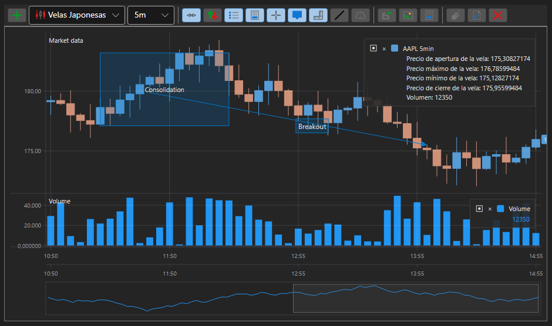
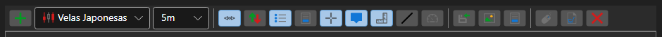

# Panel de gráfico de velas

[ChartPanel](xref:StockSharp.Xaml.Charting.ChartPanel) es un componente avanzado para crear gráficos bursátiles, que dispone de una barra de herramientas y funcionalidad adicional. La técnica de construcción de gráficos con [ChartPanel](xref:StockSharp.Xaml.Charting.ChartPanel) no difiere significativamente de la de [Chart](candle_chart.md). 

Las siguientes figuras muestran la apariencia del componente, así como las funciones de los botones de la barra de herramientas. 

1 - Línea horizontal;

2 - Línea vertical;

3 - Sugerencia;

4 - Línea de tendencia;

5 - Área;

6 - Esto es un texto.

**Funcionalidad de la barra de herramientas**

1 - Agregar panel;

2 - Habilitar desplazamiento automático;

3 - Habilitar escalado automático;

4 - Habilitar leyenda;

5 - Habilitar área de vista previa;

6 - Habilitar cruz;

7 - Habilitar sugerencia para la barra;

8 - Mostrar valores en el eje;

9 - Dibujar línea de tendencia;

10 - Dibujar puntero;

11 - Dibujar línea vertical;

12 - Dibujar línea horizontal;

13 - Seleccionar área;

14 - Etiqueta de texto;

15 - Mostrar estadísticas FPS;

16 - Registro de órdenes;

17 - Guardar datos;

18 - Publicación;

