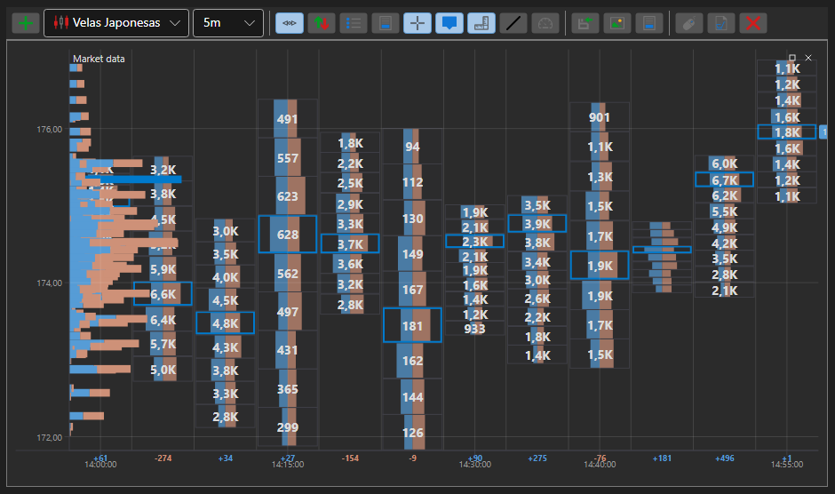

# Gráfico de clústeres

ClusterChart - es un tipo especial de gráfico para mostrar volúmenes en forma de clústeres con histogramas. Para usar este tipo de gráfico, debe establecer el estilo especial [IChartCandleElement.DrawStyle](xref:StockSharp.Charting.IChartCandleElement.DrawStyle) \= [ChartCandleDrawStyles.ClusterProfile](xref:StockSharp.Charting.ChartCandleDrawStyles.ClusterProfile). Este gráfico usa la información de la propiedad [PriceLevels](xref:StockSharp.Messages.CandleMessage.PriceLevels) como datos de origen.

**Propiedades principales**

- [ChartCandleElement.ClusterLineColor](xref:StockSharp.Xaml.Charting.ChartCandleElement.ClusterLineColor) - color básico de la línea del clúster. 
- [ChartCandleElement.ClusterTextColor](xref:StockSharp.Xaml.Charting.ChartCandleElement.ClusterTextColor) - color de los valores de volumen en el gráfico. 
- [ChartCandleElement.ClusterColor](xref:StockSharp.Xaml.Charting.ChartCandleElement.ClusterColor) - color principal de las barras en los histogramas de clústeres. 
- [ChartCandleElement.ClusterMaxColor](xref:StockSharp.Xaml.Charting.ChartCandleElement.ClusterMaxColor) - color de la barra de volumen máximo en los histogramas de clústeres. 

Hay un ejemplo de uso de este tipo de gráfico en *Samples\/Common\/SampleChart*. 

> [!TIP]
> Para cambiar entre los tipos de gráfico, use el botón de configuración (engranaje), situado en la esquina superior izquierda del gráfico.

