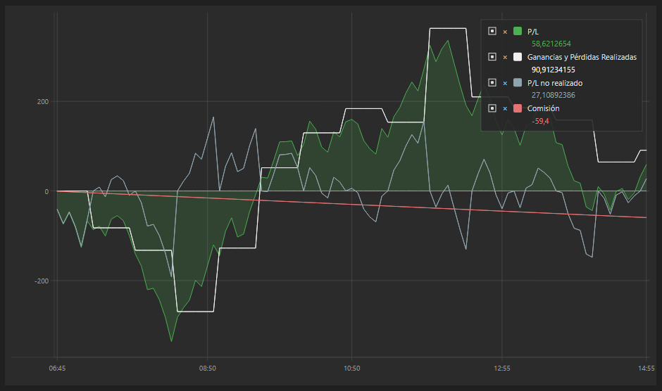

# Gráfico de curva de patrimonio

[EquityCurveChart](xref:StockSharp.Xaml.Charting.EquityCurveChart) - componente gráfico para mostrar la curva de patrimonio. 

A continuación se muestra un ejemplo de uso de este componente. El código completo del ejemplo está en Samples\/Testing\/SampleHistoryTesting. 



## Ejemplo de construcción de EquityCurveChart

1. Agregamos el componente gráfico [EquityCurveChart](xref:StockSharp.Xaml.Charting.EquityCurveChart) a XAML. Asignamos el nombre **Curve** al componente. 

   ```xaml
   <Window x:Class="SampleRandomEmulation.MainWindow"
           xmlns="http://schemas.microsoft.com/winfx/2006/xaml/presentation"
           xmlns:x="http://schemas.microsoft.com/winfx/2006/xaml"
           xmlns:loc="clr-namespace:StockSharp.Localization;assembly=StockSharp.Localization"
           Title="{x:Static loc:LocalizedStrings.XamlStr564}" Height="460" Width="604"
   		xmlns:sx="clr-namespace:StockSharp.Xaml;assembly=StockSharp.Xaml"
   		xmlns:charting="http://schemas.stocksharp.com/xaml">
       
   	<Grid>
   		<Grid.ColumnDefinitions>
   			<ColumnDefinition Width="85*" />
   			<ColumnDefinition Width="497*" />
   		</Grid.ColumnDefinitions>
   		<Grid.RowDefinitions>
   			<RowDefinition Height="Auto"/>
   			<RowDefinition Height="*"/>
   		</Grid.RowDefinitions>
   		<Grid Grid.ColumnSpan="2">
   			<Grid.ColumnDefinitions>
   				<ColumnDefinition Width="100" />
   				<ColumnDefinition Width="*" />
   				<ColumnDefinition Width="Auto" />
   			</Grid.ColumnDefinitions>
   			<Grid.RowDefinitions>
   				<RowDefinition Height="Auto" />
   				<RowDefinition Height="10" />
   				<RowDefinition Height="Auto" />
   				<RowDefinition Height="10" />
   			</Grid.RowDefinitions>
   			<Button x:Name="StartBtn" Content="{x:Static loc:LocalizedStrings.Str2421}" Grid.Row="0" Click="StartBtnClick" />
   			<ProgressBar x:Name="TestingProcess" Grid.Column="1" Grid.Row="0" />
   			<Button x:Name="Report" Content="{x:Static loc:LocalizedStrings.XamlStr432}" Grid.Row="0" Width="75" IsEnabled="False" Click="ReportClick" Grid.Column="2" Margin="0,0,0,-1" />
   		</Grid>
   		
   		<Grid Grid.Row="1" Grid.ColumnSpan="2" Grid.Column="0">
   			<Grid>
   				<Grid.ColumnDefinitions>
   					<ColumnDefinition Width="180"/>
   					<ColumnDefinition Width="*"/>
   				</Grid.ColumnDefinitions>
   				<sx:StatisticParameterGrid Grid.Column="0" x:Name="ParameterGrid" />
   				<charting:EquityCurveChart Grid.Column="1" x:Name="EquityCurveChart" />
   			</Grid>
   		</Grid>
   	</Grid>
   </Window>
   	  				
   ```
2. En el código de la ventana principal, creamos una fuente de datos para dibujar el gráfico mediante el método [EquityCurveChart.CreateCurve](xref:StockSharp.Xaml.Charting.EquityCurveChart.CreateCurve(System.String,System.Windows.Media.Color,System.Windows.Media.Color,Ecng.Drawing.DrawStyles,System.Guid))**(**título [System.String](xref:System.String), color [System.Windows.Media.Color](xref:System.Windows.Media.Color), secondColor [System.Windows.Media.Color](xref:System.Windows.Media.Color), estilo [Ecng.Drawing.DrawStyles](xref:Ecng.Drawing.DrawStyles), id [System.Guid](xref:System.Guid) **)**. 

   ```cs
   private ChartBandElement _pnl;
   private ChartBandElement _unrealizedPnL;
   private ChartBandElement _commissionCurve;

   .................................................
                 		
   public MainWindow()
   {
   	InitializeComponent();

   	_logManager.Listeners.Add(new FileLogListener("log.txt"));

	_pnl = (ChartBandElement)EquityCurveChart.CreateCurve("PNL", Colors.Green, DrawStyles.Area);
	_unrealizedPnL = (ChartBandElement)EquityCurveChart.CreateCurve("unrealizedPnL", Colors.Black, DrawStyles.Line);
	_commissionCurve = (ChartBandElement)EquityCurveChart.CreateCurve("commissionCurve", Colors.Red, DrawStyles.Line);
   }
   	  				
   ```
3. Cuando cambia el valor de PnL de la estrategia, agregamos datos a la fuente de datos. En este caso usamos la clase especial [ChartDrawData](xref:StockSharp.Xaml.Charting.ChartDrawData). 

   ```cs
   _strategy.PnLChanged += () =>
   {
   	var data = new ChartDrawData();
	data.Group(_strategy.CurrentTime)
		.Add(_pnl, _strategy.PnL)
		.Add(_unrealizedPnL, _strategy.PnLManager.UnrealizedPnL ?? 0)
		.Add(_commissionCurve, _strategy.Commission ?? 0);
	
	EquityCurveChart.Draw(data);
   };
   	  				
   ```

