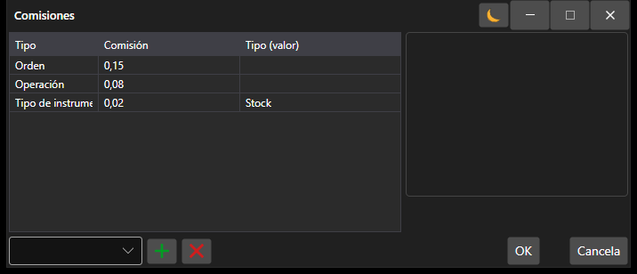

# Ventana de configuración de comisiones

[CommissionWindow](xref:StockSharp.Xaml.CommissionWindow) - Ventana especial para configurar las reglas de cobro de comisiones.



A continuación se muestra un ejemplo del código para llamar a una ventana de configuración de reglas de cobro de comisiones.

```cs
		private void RiskButton_OnClick(object sender, RoutedEventArgs e)
		{
			var wnd = new CommissionWindow();
			wnd.Rules.AddRange(Strategy.RiskManager.Rules.Select(r => r.Clone()));
			if (!wnd.ShowModal(this))
				return;
			Strategy.RiskManager.Rules.Clear();
			Strategy.RiskManager.Rules.AddRange(wnd.Rules);
		}
	  				
```

