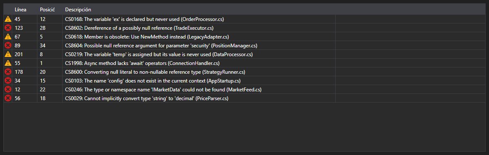

# Errores de compilación



[ErrorsGrid](xref:StockSharp.Xaml.Code.ErrorsGrid) - una tabla de errores de compilación. Para cada entrada [CompilationError](xref:Ecng.Compilation.CompilationError) muestra el tipo (error, advertencia, mensaje), la línea, la posición en la línea y el texto.

**Propiedades principales**

- [ErrorsGrid.Errors](xref:StockSharp.Xaml.Code.ErrorsGrid.Errors) - lista de errores de compilación.

El evento `ErrorSelected` se genera al hacer doble clic en una fila: el editor de código mueve el cursor a esa línea. Así la tabla y el editor forman el par habitual de lista de errores y salto al lugar del error.

A continuación se muestran fragmentos de código con su uso:

```xaml
<Window x:Class="Sample.CompilationWindow"
	xmlns="http://schemas.microsoft.com/winfx/2006/xaml/presentation"
	xmlns:x="http://schemas.microsoft.com/winfx/2006/xaml"
	xmlns:code="clr-namespace:StockSharp.Xaml.Code;assembly=StockSharp.Xaml"
	Height="200" Width="800">
	<code:ErrorsGrid x:Name="ErrorsGrid" />
</Window>
```

```cs
// Mostramos el resultado de la compilación
var result = compiler.Compile("Strategy", sources, references);

ErrorsGrid.Errors.Clear();
ErrorsGrid.Errors.AddRange(result.Errors);

// Con doble clic saltamos a la línea del error
ErrorsGrid.ErrorSelected += error => CodePanel.Code.SelectLine(error.Line);
```

## Ver también

[Diagnóstico](../diagnostics.md)
