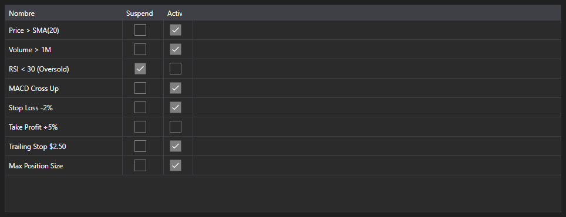

# Reglas activas



[MarketRuleGrid](xref:StockSharp.Xaml.MarketRuleGrid) - una tabla de reglas [IMarketRule](xref:StockSharp.Algo.IMarketRule) creadas por una estrategia o un conector. Muestra el nombre de la regla y los indicadores de suspensión y de actividad.

**Propiedades principales**

- [MarketRuleGrid.Rules](xref:StockSharp.Xaml.MarketRuleGrid.Rules) - lista de reglas; normalmente [Strategy.Rules](xref:StockSharp.Algo.Strategies.Strategy.Rules).

La tabla es útil cuando hay muchas reglas y hace falta saber cuáles siguen vivas. Una regla desaparece de la lista cuando se ha disparado y se ha retirado, por lo que una fuga se ve enseguida: una regla que debía retirarse pero permanece.

A continuación se muestran fragmentos de código con su uso:

```xaml
<Window x:Class="Sample.RulesWindow"
	xmlns="http://schemas.microsoft.com/winfx/2006/xaml/presentation"
	xmlns:x="http://schemas.microsoft.com/winfx/2006/xaml"
	xmlns:xaml="http://schemas.stocksharp.com/xaml"
	Height="300" Width="600">
	<xaml:MarketRuleGrid x:Name="RuleGrid" />
</Window>
```

```cs
// Mostramos las reglas de la estrategia
RuleGrid.Rules = _strategy.Rules;

// Cada regla creada aparece en la tabla
_strategy
	.WhenPositionChanged()
	.Do(() => LogInfo("position={0}", _strategy.Position))
	.Apply(_strategy);
```

## Ver también

[Diagnóstico](../diagnostics.md)
