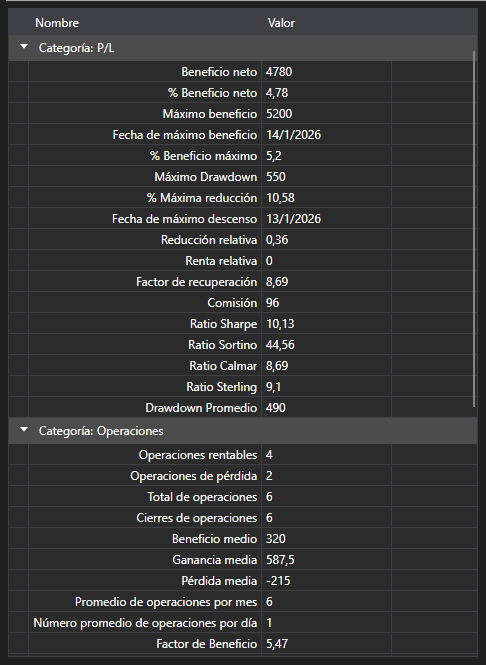

# Estadísticas de la estrategia



[StatisticParameterGrid](xref:StockSharp.Xaml.StatisticParameterGrid) - tabla de parámetros estadísticos [IStatisticParameter](xref:StockSharp.Algo.Statistics.IStatisticParameter) de una sola estrategia. Los parámetros están agrupados por categorías (operaciones, órdenes, rentabilidad, drawdown) y en cada fila figuran el nombre, el valor actual y la descripción.

**Propiedades y métodos principales**

- [StatisticParameterGrid.StatisticManager](xref:StockSharp.Xaml.StatisticParameterGrid.StatisticManager) - gestor de estadísticas cuyos parámetros muestra la tabla. Normalmente es [Strategy.StatisticManager](xref:StockSharp.Algo.Strategies.Strategy.StatisticManager).
- [StatisticParameterGrid.Parameters](xref:StockSharp.Xaml.StatisticParameterGrid.Parameters) - lista de parámetros, si se establece directamente y no a través del gestor.
- [StatisticParameterGrid.Reset](xref:StockSharp.Xaml.StatisticParameterGrid.Reset) - restablece los valores acumulados.

Los valores se actualizan a medida que la estrategia trabaja, por eso la tabla se coloca junto al gráfico: el gráfico muestra cómo transcurrió la operativa y la tabla, cuánto ha costado. Al repetir el mismo cálculo hay que llamar a `Reset`, de lo contrario los valores nuevos se superpondrán a los antiguos.

A diferencia de [StrategiesStatisticsPanel](xref:StockSharp.Xaml.StrategiesStatisticsPanel), que compara varias estrategias por las mismas columnas, esta tabla desglosa por completo una sola estrategia.

A continuación se muestran fragmentos de código con su uso:

```xaml
<Window x:Class="Sample.StatisticsWindow"
	xmlns="http://schemas.microsoft.com/winfx/2006/xaml/presentation"
	xmlns:x="http://schemas.microsoft.com/winfx/2006/xaml"
	xmlns:xaml="http://schemas.stocksharp.com/xaml"
	Height="500" Width="400">
	<xaml:StatisticParameterGrid x:Name="StatisticGrid" />
</Window>
```

```cs
// Mostramos las estadísticas de la estrategia
StatisticGrid.StatisticManager = _strategy.StatisticManager;

// Antes de repetir la iteración restablecemos los valores acumulados
StatisticGrid.Reset();
```

## Ver también

[Diagnóstico](../diagnostics.md)

[Estadísticas](../strategies/statistics.md)
