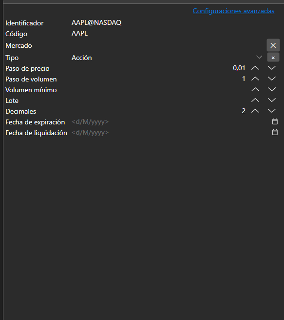
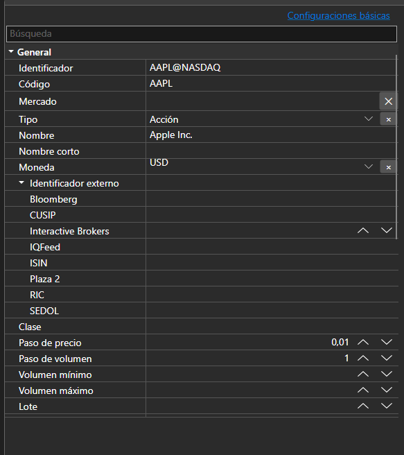

# Propiedades básicas y avanzadas





[BasicAdvPropertiesPanel](xref:StockSharp.Xaml.PropertyGrid.BasicAdvPropertiesPanel) - un panel de propiedades con dos modos. El modo básico muestra una lista corta de campos obligatorios y el avanzado todas las propiedades del objeto agrupadas por categorías.

**Propiedades principales**

- [BasicAdvPropertiesPanel.SelectedObject](xref:StockSharp.Xaml.PropertyGrid.BasicAdvPropertiesPanel.SelectedObject) - objeto editado.
- [BasicAdvPropertiesPanel.IsAdvancedMode](xref:StockSharp.Xaml.PropertyGrid.BasicAdvPropertiesPanel.IsAdvancedMode) - indicador del modo avanzado.
- [BasicAdvPropertiesPanel.PlainMaxDepth](xref:StockSharp.Xaml.PropertyGrid.BasicAdvPropertiesPanel.PlainMaxDepth) - profundidad de expansión de las propiedades anidadas en el modo básico.
- [BasicAdvPropertiesPanel.PostImmediately](xref:StockSharp.Xaml.PropertyGrid.BasicAdvPropertiesPanel.PostImmediately) - aplicar el valor al escribirlo, sin esperar a salir del campo.

Los dos modos resuelven el problema habitual de la configuración del conector: hay tres o cuatro campos obligatorios y varias decenas de propiedades en total. El modo básico muestra solo aquello sin lo cual la conexión no funciona; el resto sigue disponible en el modo avanzado.

A continuación se muestran fragmentos de código con su uso:

```xaml
<Window x:Class="Sample.SettingsWindow"
	xmlns="http://schemas.microsoft.com/winfx/2006/xaml/presentation"
	xmlns:x="http://schemas.microsoft.com/winfx/2006/xaml"
	xmlns:pg="clr-namespace:StockSharp.Xaml.PropertyGrid;assembly=StockSharp.Xaml"
	Height="500" Width="400">
	<pg:BasicAdvPropertiesPanel x:Name="PropertiesPanel" />
</Window>
```

```cs
// Mostramos las propiedades del adaptador
PropertiesPanel.SelectedObject = _adapter;

// Cambiamos al modo avanzado
PropertiesPanel.IsAdvancedMode = true;

// Marcamos que la configuración cambió
PropertiesPanel.CellValueChanged += (sender, e) => _isModified = true;
```

## Ver también

[Editores de valores](../editors.md)
