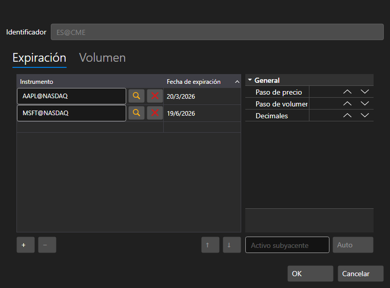

# Futuros continuos

[ContinuousSecurityWindow](xref:StockSharp.Xaml.ContinuousSecurityWindow) - es un editor visual para crear instrumentos *continuos* ([ContinuousSecurity](xref:StockSharp.Algo.ContinuousSecurity)). Consulte [Futuros continuos](../../instruments/continuous_futures.md). 



Este componente incluye: 

- Campo de texto especial [SecurityIdTextBox](xref:StockSharp.Xaml.SecurityIdTextBox), que genera un instrumento *continuo* con la entrada de Id - \[Código\]@\[Mercado\].
- El componente [SecurityJumpsEditor](xref:StockSharp.Xaml.SecurityJumpsEditor) es un DataGrid especial para trabajar con instrumentos que forman parte de un instrumento *continuo*. Los instrumentos se envuelven en la clase [SecurityJump](xref:StockSharp.Xaml.SecurityJump), que tiene dos propiedades: [SecurityJump.Security](xref:StockSharp.Xaml.SecurityJump.Security) y [SecurityJump.Date](xref:StockSharp.Xaml.SecurityJump.Date) (roll forward). Los instrumentos agregados se almacenan en la lista [SecurityJumpsEditor.Jumps](xref:StockSharp.Xaml.SecurityJumpsEditor.Jumps). El componente tiene la función [SecurityJumpsEditor.Validate](xref:StockSharp.Xaml.SecurityJumpsEditor.Validate) para comprobar la corrección de los instrumentos del componente. 
- Botones para agregar\/eliminar instrumentos. 
- El botón **Auto** permite crear automáticamente un instrumento *continuo*. 
- El botón **Ok** completa la creación de un instrumento *continuo*. 

**Propiedades principales**

- [ContinuousSecurityWindow.Security](xref:StockSharp.Xaml.ContinuousSecurityWindow.Security) - instrumento continuo
- [ContinuousSecurityWindow.SecurityStorage](xref:StockSharp.Xaml.ContinuousSecurityWindow.SecurityStorage) - proveedor de información sobre instrumentos.

A continuación se muestra el fragmento de código con su uso. 

```cs
private void CreateContinuousSecurity_OnClick(object sender, RoutedEventArgs e)
{
	_continuousSecurityWindow = new ContinuousSecurityWindow
	{
		SecurityStorage = _entityRegistry.Securities,
		Security = new ContinuousSecurity { Board = ExchangeBoard.Associated }
	};
	if (!_continuousSecurityWindow.ShowModal(this))
		return;
	_continuousSecurity = _continuousSecurityWindow.Security;
	ContinuousSecurity.Content = _continuousSecurity.Id;
	var first = _continuousSecurity.InnerSecurities.First();
	var gluingSecurity = new Security
	{
		Id = _continuousSecurity.Id,
		Code = _continuousSecurity.Code,
		Board = ExchangeBoard.Associated,
		Type = _continuousSecurity.Type,
		VolumeStep = first.VolumeStep,
		PriceStep = first.PriceStep,
		ExtensionInfo = new Dictionary<object, object> { { "GluingSecurity", true } }
	};
	if (_entityRegistry.Securities.ReadById(gluingSecurity.Id) == null)
	{
		_entityRegistry.Securities.Save(gluingSecurity);
	}
}
```

## Contenido recomendado

[Futuros continuos](../../../hydra/instruments_and_boards/continuous_futures.md)
