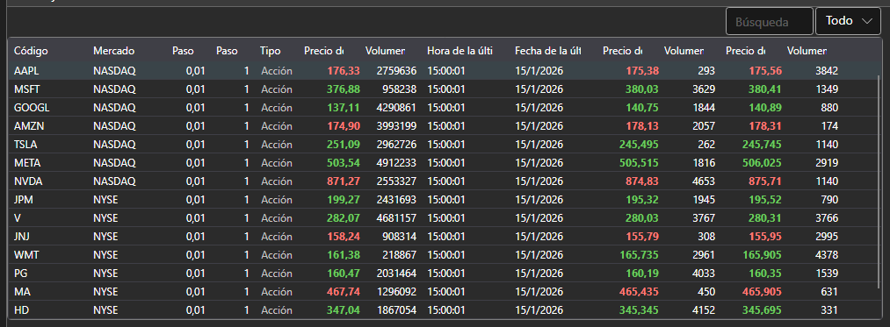

# Selector

El componente [SecurityPicker](xref:StockSharp.Xaml.SecurityPicker) está diseñado para buscar y seleccionar instrumentos. Admite selección única y múltiple. El componente permite filtrar la lista de instrumentos por su tipo. Este componente también se puede usar para mostrar información financiera (campos level1), como se muestra en la sección [SecurityGrid](table.md). 



[SecurityPicker](xref:StockSharp.Xaml.SecurityPicker) consta de: 

1. Un campo de texto para introducir el código (o Id) del instrumento. Al introducir texto, la lista se filtra por la subcadena introducida.
2. El combo box especial [SecurityTypeComboBox](xref:StockSharp.Xaml.SecurityTypeComboBox) para filtrar instrumentos por su tipo.
3. La tabla [SecurityGrid](xref:StockSharp.Xaml.SecurityGrid) para mostrar la lista de instrumentos.

**Propiedades principales**

- [SecurityPicker.SelectionMode](xref:StockSharp.Xaml.SecurityPicker.SelectionMode) - modo de selección de instrumentos: único, múltiple.
- [SecurityPicker.ShowCommonStatColumns](xref:StockSharp.Xaml.SecurityPicker.ShowCommonStatColumns) - para mostrar las columnas principales.
- [SecurityPicker.ShowCommonOptionColumns](xref:StockSharp.Xaml.SecurityPicker.ShowCommonOptionColumns) - para mostrar las columnas principales de opciones.
- [SecurityPicker.Title](xref:StockSharp.Xaml.SecurityPicker.Title) - título que se muestra en la parte superior del componente.
- [SecurityPicker.Securities](xref:StockSharp.Xaml.SecurityPicker.Securities) - lista de instrumentos.
- [SecurityPicker.SelectedSecurity](xref:StockSharp.Xaml.SecurityPicker.SelectedSecurity) - instrumento seleccionado.
- [SecurityPicker.SelectedSecurities](xref:StockSharp.Xaml.SecurityPicker.SelectedSecurities) - lista de instrumentos seleccionados.
- [SecurityPicker.FilteredSecurities](xref:StockSharp.Xaml.SecurityPicker.FilteredSecurities) - lista de instrumentos filtrados.
- [SecurityPicker.ExcludeSecurities](xref:StockSharp.Xaml.SecurityPicker.ExcludeSecurities) - lista de instrumentos ocultos.
- [SecurityPicker.SelectedType](xref:StockSharp.Xaml.SecurityPicker.SelectedType) - tipo de instrumento seleccionado.
- [SecurityPicker.SecurityProvider](xref:StockSharp.Xaml.SecurityPicker.SecurityProvider) - proveedor de información sobre instrumentos.
- [SecurityPicker.MarketDataProvider](xref:StockSharp.Xaml.SecurityPicker.MarketDataProvider) - proveedor de datos de mercado.

A continuación se muestra el fragmento de código con su uso, tomado del ejemplo *Samples\/InteractiveBrokers\/SampleIB*. 

```xaml
<Window x:Class="Sample.SecuritiesWindow"
	xmlns="http://schemas.microsoft.com/winfx/2006/xaml/presentation"
	xmlns:x="http://schemas.microsoft.com/winfx/2006/xaml"
	xmlns:loc="clr-namespace:StockSharp.Localization;assembly=StockSharp.Localization"
	xmlns:xaml="http://schemas.stocksharp.com/xaml"
	Title="{x:Static loc:LocalizedStrings.Securities}" Height="415" Width="1081">
	<Grid>
		<Grid.RowDefinitions>
			<RowDefinition Height="*" />
			<RowDefinition Height="Auto" />
		</Grid.RowDefinitions>
		<xaml:SecurityPicker x:Name="SecurityPicker" x:FieldModifier="public" SecuritySelected="SecurityPicker_OnSecuritySelected" ShowCommonStatColumns="True" />
	</Grid>
</Window>
	  	
```
```cs
private void ConnectClick(object sender, RoutedEventArgs e)
{
	......................................
	_connector.SecurityReceived += (sub, security) => _securitiesWindow.SecurityPicker.Securities.Add(security);
	_securitiesWindow.SecurityPicker.MarketDataProvider = _connector;
	......................................
}
private void SecurityPicker_OnSecuritySelected(Security security)
{
	NewStopOrder.IsEnabled = NewOrder.IsEnabled =
	Level1.IsEnabled = Depth.IsEnabled = security != null;
}
```

