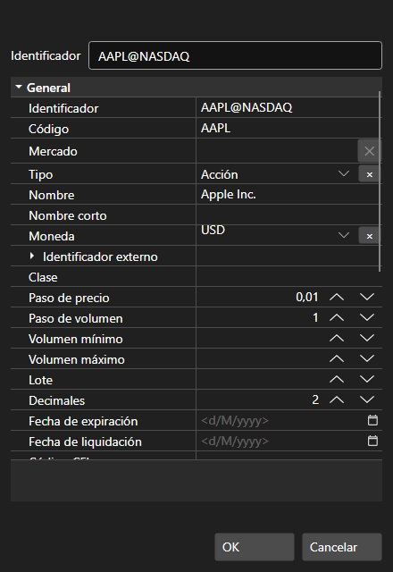

# Ventana

El componente [SecurityCreateWindow](xref:StockSharp.Xaml.SecurityCreateWindow) es una ventana para crear y editar un instrumento. El componente consta de dos elementos principales: el campo de texto especial [SecurityIdTextBox](xref:StockSharp.Xaml.SecurityIdTextBox) y la tabla de edición de propiedades [PropertyGridEx](xref:StockSharp.Xaml.PropertyGrid.PropertyGridEx). Puede acceder al instrumento creado (editado) mediante la propiedad [SecurityCreateWindow.Security](xref:StockSharp.Xaml.SecurityCreateWindow.Security). 

A continuación se muestra la apariencia del componente y el fragmento de código con su uso. 



```cs
private void Button_Click(object sender, RoutedEventArgs e)
{
	var dlg = new SecurityCreateWindow();
	var result = dlg.ShowDialog();
	if (result != null && (bool)result)
	{
		var security = dlg.Security;
	}
}
	
```

