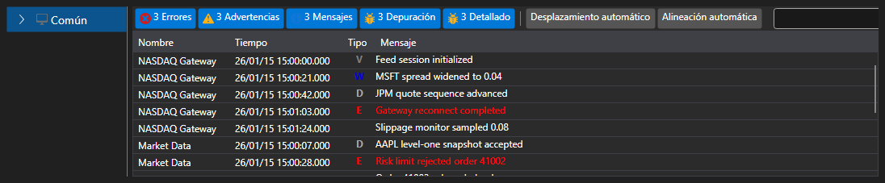

# Panel de registros extendido

[Monitor](xref:StockSharp.Xaml.Monitor) - es el elemento visual donde [LogControl](log_panel.md) se usa junto con el árbol jerárquico **TreeView**, en el que se muestran las fuentes de log. Inicialmente, el componente se diseñó para supervisar estrategias de trading. Por ello, de forma predeterminada, el "árbol" incluye el nodo **Estrategia**. Al mismo tiempo, con este componente se pueden usar otras fuentes.



Código de ejemplo

```xaml
<Window x:Class="LoggingControls.MainWindow"
		xmlns="http://schemas.microsoft.com/winfx/2006/xaml/presentation"
		xmlns:x="http://schemas.microsoft.com/winfx/2006/xaml"
		xmlns:sx="clr-namespace:StockSharp.Xaml;assembly=StockSharp.Xaml"
		Title="MainWindow" Height="350" Width="525">
	<Grid>
		<sx:Monitor x:Name="Monitor" />
	</Grid>
</Window>
				
```
```cs
// crear una nueva instancia de LogManager
_logManager = new LogManager();
// agregar .NET tracing como fuente de log.
_logManager.Sources.Add(new Ecng.Logging.TraceSource());
// agregar Monitor como receptor de registro.
_logManager.Listeners.Add(new GuiLogListener(Monitor));
					
```
