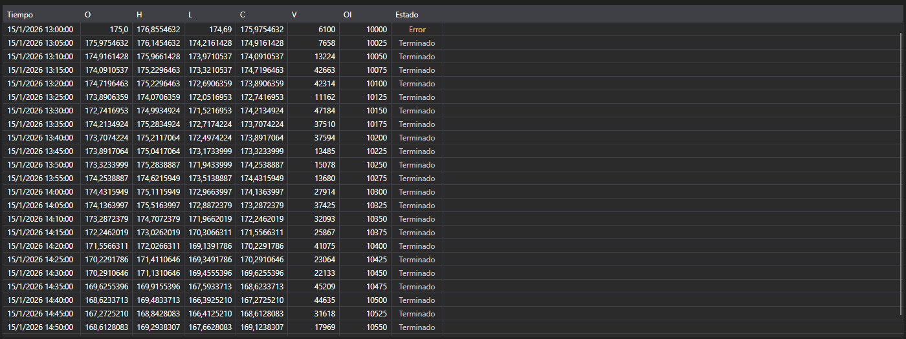

# Velas



[CandleMessageGrid](xref:StockSharp.Xaml.CandleMessageGrid) - una tabla de velas. Muestra los precios de apertura, máximo, mínimo y cierre, los volúmenes, el interés abierto y el estado de cada vela.

**Propiedades principales**

- [CandleMessageGrid.Messages](xref:StockSharp.Xaml.CandleMessageGrid.Messages) - lista de velas.
- [CandleMessageGrid.SelectedMessage](xref:StockSharp.Xaml.CandleMessageGrid.SelectedMessage) - vela seleccionada.
- [CandleMessageGrid.SelectedMessages](xref:StockSharp.Xaml.CandleMessageGrid.SelectedMessages) - velas seleccionadas.

## Estados de la vela

La columna **State** se colorea según el valor de [CandleStates](xref:StockSharp.Messages.CandleStates), y la captura muestra los tres:

- **Active** - la vela aún se está formando. Se resalta porque sus valores siguen cambiando: no debe leerse como una vela cerrada.
- **Finished** - la vela está cerrada y sus valores son definitivos. Color neutro; la mayoría de las filas de la tabla son así.
- **None** - no llegó ningún estado. La tabla lo etiqueta como **Error** y lo colorea como advertencia: no es un valor vacío, sino la señal de que los datos llegaron incompletos.

Por tanto, una suscripción de velas que muestra **Error** en su primera fila informa de un problema de la fuente de datos, no de una vela sin estado.

A continuación, fragmentos de código que muestran su uso:

```xaml
<Window x:Class="Sample.CandlesWindow"
	xmlns="http://schemas.microsoft.com/winfx/2006/xaml/presentation"
	xmlns:x="http://schemas.microsoft.com/winfx/2006/xaml"
	xmlns:xaml="http://schemas.stocksharp.com/xaml"
	Title="Velas" Height="400" Width="800">
	<xaml:CandleMessageGrid x:Name="CandleGrid" x:FieldModifier="public" />
</Window>
```

```cs
public class CandlesWindow
{
	private readonly Connector _connector;
	private readonly Security _security;
	private Subscription _candleSubscription;

	public CandlesWindow(Connector connector, Security security)
	{
		InitializeComponent();

		_connector = connector;
		_security = security;

		// Suscribirse al evento de recepción de velas
		_connector.CandleReceived += OnCandleReceived;

		// Crear una suscripción a velas de cinco minutos
		_candleSubscription = new Subscription(TimeSpan.FromMinutes(5).TimeFrame(), security);

		// Iniciar la suscripción
		_connector.Subscribe(_candleSubscription);
	}

	// Manejador de vela recibida
	private void OnCandleReceived(Subscription subscription, ICandleMessage candle)
	{
		// Comprobar que la vela pertenece a nuestra suscripción
		if (subscription != _candleSubscription)
			return;

		// Añadir la vela a la tabla en el hilo de la interfaz
		this.GuiAsync(() => CandleGrid.Messages.Add((CandleMessage)candle));
	}

	// Cancelar la suscripción al cerrar la ventana
	public void Unsubscribe()
	{
		if (_candleSubscription != null)
		{
			_connector.CandleReceived -= OnCandleReceived;
			_connector.UnSubscribe(_candleSubscription);
			_candleSubscription = null;
		}
	}
}
```

### Solo velas finalizadas

Hasta que una vela cierra llega muchas veces, así que la tabla crece en cada actualización. Cuando solo importan los valores finales, filtre por estado:

```cs
private void OnCandleReceived(Subscription subscription, ICandleMessage candle)
{
	if (subscription != _candleSubscription)
		return;

	// Omitir todo lo que aún se está formando
	if (candle.State != CandleStates.Finished)
		return;

	this.GuiAsync(() => CandleGrid.Messages.Add((CandleMessage)candle));
}
```

### Actualizar la vela actual en su sitio

Para mantener la vela actual en la tabla y actualizarla en lugar de añadirla de nuevo, reemplace la última fila hasta que la vela cierre:

```cs
private void OnCandleReceived(Subscription subscription, ICandleMessage candle)
{
	if (subscription != _candleSubscription)
		return;

	var message = (CandleMessage)candle;

	this.GuiAsync(() =>
	{
		var last = CandleGrid.Messages.LastOrDefault();

		// La misma vela que la última fila: se reemplaza
		if (last != null && last.OpenTime == message.OpenTime)
			CandleGrid.Messages[CandleGrid.Messages.Count - 1] = message;
		else
			CandleGrid.Messages.Add(message);
	});
}
```

### Carga de velas históricas

```cs
// Cargar velas históricas
public void LoadHistoricalCandles(Security security, TimeSpan timeFrame, DateTime from, DateTime to)
{
	// Limpiar las velas actuales
	CandleGrid.Messages.Clear();

	// Crear una suscripción a velas históricas
	var historySubscription = new Subscription(timeFrame.TimeFrame(), security)
	{
		MarketData =
		{
			// Indicar el periodo de los datos históricos
			From = from,
			To = to
		}
	};

	_connector.CandleReceived += OnCandleReceived;
	_connector.Subscribe(historySubscription);
}
```

## Véase también

[Operaciones tick](ticks.md)
