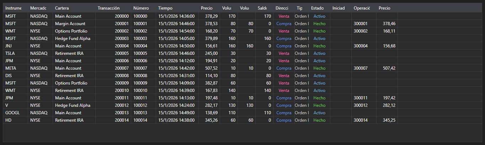

# Transacciones y operaciones



[ExecutionGrid](xref:StockSharp.Xaml.ExecutionGrid) - una tabla universal de mensajes [ExecutionMessage](xref:StockSharp.Messages.ExecutionMessage). Un solo control muestra ticks, registro de órdenes y transacciones propias \- el tipo de datos lo define [ExecutionMessage.DataTypeEx](xref:StockSharp.Messages.ExecutionMessage.DataTypeEx).

**Propiedades principales**

- [ExecutionGrid.Messages](xref:StockSharp.Xaml.ExecutionGrid.Messages) - lista de mensajes.
- [ExecutionGrid.SelectedMessage](xref:StockSharp.Xaml.ExecutionGrid.SelectedMessage) - mensaje seleccionado.
- [ExecutionGrid.SelectedMessages](xref:StockSharp.Xaml.ExecutionGrid.SelectedMessages) - mensajes seleccionados.
- [ExecutionGrid.MaxCount](xref:StockSharp.Xaml.ExecutionGrid.MaxCount) - número máximo de filas de la tabla; al superarlo se eliminan las filas más antiguas.

Como la misma tabla sirve para tres tipos de datos, las columnas que sobran se ocultan con [ExecutionGrid.HideColumns](xref:StockSharp.Xaml.ExecutionGrid.HideColumns(StockSharp.Messages.DataType)): los ticks no necesitan columnas de órdenes, el registro de órdenes no necesita columnas de operaciones propias.

A continuación se muestran fragmentos de código con su uso:

```xaml
<Window x:Class="Sample.ExecutionsWindow"
	xmlns="http://schemas.microsoft.com/winfx/2006/xaml/presentation"
	xmlns:x="http://schemas.microsoft.com/winfx/2006/xaml"
	xmlns:xaml="http://schemas.stocksharp.com/xaml"
	Height="400" Width="900">
	<xaml:ExecutionGrid x:Name="ExecutionGrid" />
</Window>
```

```cs
// Dejamos solo las columnas relativas a transacciones
ExecutionGrid.HideColumns(DataType.Transactions);

// Añadimos las órdenes a la tabla en el hilo de la interfaz
_connector.OrderReceived += (subscription, order) =>
	this.GuiAsync(() => ExecutionGrid.Messages.Add(order.ToMessage()));

// Limitamos el tamaño de la tabla
ExecutionGrid.MaxCount = 100000;
```

## Ver también

[Datos de mercado](../market_data.md)
