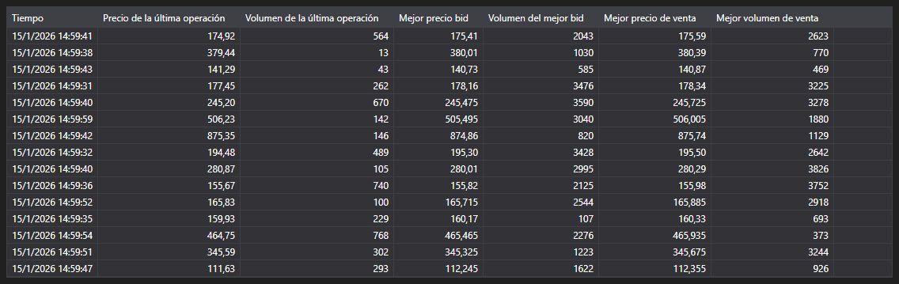

# Level1



[Level1Grid](xref:StockSharp.Xaml.Level1Grid) - tabla para mostrar campos Level1. Esta tabla usa datos en forma de mensajes [Level1ChangeMessage](xref:StockSharp.Messages.Level1ChangeMessage).

**Propiedades principales**

- [Level1Grid.MaxCount](xref:StockSharp.Xaml.Level1Grid.MaxCount) - número máximo de mensajes que se mostrarán.
- [Level1Grid.Messages](xref:StockSharp.Xaml.Level1Grid.Messages) - lista de mensajes agregados a la tabla.
- [Level1Grid.SelectedMessage](xref:StockSharp.Xaml.Level1Grid.SelectedMessage) - mensaje seleccionado.
- [Level1Grid.SelectedMessages](xref:StockSharp.Xaml.Level1Grid.SelectedMessages) - mensajes seleccionados.

A continuación se muestran fragmentos de código que demuestran su uso:

```xaml
<Window x:Class="Membrane02.Level1Window"
		xmlns="http://schemas.microsoft.com/winfx/2006/xaml/presentation"
		xmlns:x="http://schemas.microsoft.com/winfx/2006/xaml"
		xmlns:d="http://schemas.microsoft.com/expression/blend/2008"
		xmlns:mc="http://schemas.openxmlformats.org/markup-compatibility/2006"
		xmlns:sx="http://schemas.stocksharp.com/xaml"
		xmlns:local="clr-namespace:Membrane02"
		mc:Ignorable="d"
		Title="Ventana Level1" Height="300" Width="300" Closing="Window_Closing">
	<Grid>
		<sx:Level1Grid x:Name="Level1Grid" />
	</Grid>
</Window>
```

```cs
public Level1Window()
{
	InitializeComponent();
	_connector = MainWindow.This.Connector;
	
	// Suscribirse al evento de recepción de datos Level1
	_connector.Level1Received += OnLevel1Received;
	
	// Crear una suscripción a datos Level1 si aún no existe
	var security = MainWindow.This.SelectedSecurity;
	if (!_connector.Subscriptions.Any(s => 
			s.DataType == DataType.Level1 && 
			s.SecurityId == security.ToSecurityId()))
	{
		var subscription = new Subscription(DataType.Level1, security);
		_connector.Subscribe(subscription);
	}
}

private void OnLevel1Received(Subscription subscription, Level1ChangeMessage level1Message)
{
	// Comprobar si el mensaje pertenece al instrumento seleccionado
	if (level1Message.SecurityId != MainWindow.This.SelectedSecurity.ToSecurityId())
		return;
		
	// Agregar el mensaje a Level1Grid
	this.GuiAsync(() => Level1Grid.Messages.Add(level1Message));
}

private void Window_Closing(object sender, System.ComponentModel.CancelEventArgs e)
{
	// Cancelar la suscripción a eventos al cerrar la ventana
	if (_connector != null)
		_connector.Level1Received -= OnLevel1Received;
}
```

### Forma recomendada de procesar datos Level1

```cs
// Crear una suscripción a Level1 usando varios instrumentos
public void SubscribeToLevel1(IEnumerable<Security> securities)
{
	foreach (var security in securities)
	{
		var subscription = new Subscription(DataType.Level1, security);
		_connector.Subscribe(subscription);
	}
	
	// Suscribirse al evento de recepción de datos Level1
	_connector.Level1Received += OnLevel1Received;
}

// Manejador del evento de recepción de datos Level1
private void OnLevel1Received(Subscription subscription, Level1ChangeMessage level1Message)
{
	// Comprobar si debemos procesar este mensaje concreto
	if (IsLevel1Needed(subscription))
	{
		// Actualizar la GUI en el hilo de la interfaz de usuario
		this.GuiAsync(() => 
		{
			// Agregar el mensaje a Level1Grid
			Level1Grid.Messages.Add(level1Message);
			
			// Procesar cambios en campos Level1
			foreach (var change in level1Message.Changes)
			{
				switch (change.Key)
				{
					case Level1Fields.LastTradePrice:
						// Procesar cambio del precio de la última operación
						var lastPrice = (decimal)change.Value;
						Console.WriteLine($"Último precio {security.Code}: {lastPrice}");
						break;
						
					case Level1Fields.BestBidPrice:
						// Procesar cambio del mejor precio bid
						var bestBid = (decimal)change.Value;
						Console.WriteLine($"Mejor bid {security.Code}: {bestBid}");
						break;
						
					case Level1Fields.BestAskPrice:
						// Procesar cambio del mejor precio ask
						var bestAsk = (decimal)change.Value;
						Console.WriteLine($"Mejor ask {security.Code}: {bestAsk}");
						break;
				}
			}
		});
	}
}
```
