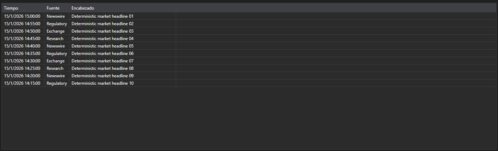
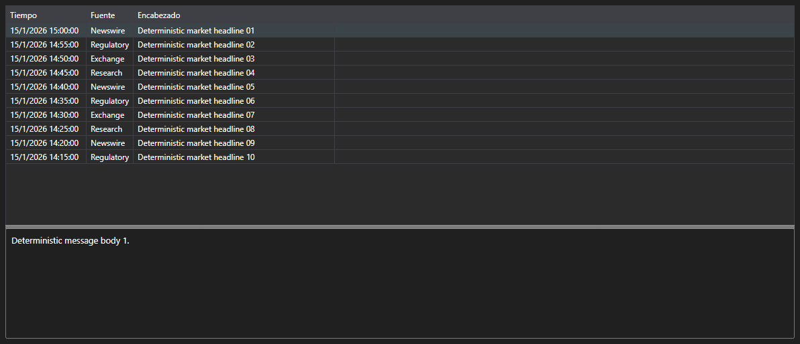

# Noticias como mensajes





[NewsMessageGrid](xref:StockSharp.Xaml.NewsMessageGrid) - una tabla de noticias que trabaja con mensajes [NewsMessage](xref:StockSharp.Messages.NewsMessage) en lugar de entidades de negocio. Muestra la hora, la fuente, el identificador, el titular y el enlace al texto completo.

**Propiedades principales**

- [NewsMessageGrid.Messages](xref:StockSharp.Xaml.NewsMessageGrid.Messages) - lista de mensajes de noticias.
- [NewsMessageGrid.SelectedMessage](xref:StockSharp.Xaml.NewsMessageGrid.SelectedMessage) - mensaje seleccionado.
- [NewsMessageGrid.SelectedMessages](xref:StockSharp.Xaml.NewsMessageGrid.SelectedMessages) - mensajes seleccionados.
- [NewsMessageGrid.MaxCount](xref:StockSharp.Xaml.NewsMessageGrid.MaxCount) - número máximo de filas de la tabla; al superarlo se eliminan las filas más antiguas.
- [NewsMessageGrid.SubscriptionProvider](xref:StockSharp.Xaml.NewsMessageGrid.SubscriptionProvider) - proveedor de suscripciones al que la tabla solicita el texto completo de la noticia.

La combinación lista de tabla y texto de la noticia es [NewsMessagePanel](xref:StockSharp.Xaml.NewsMessagePanel). Contiene [NewsMessageGrid](xref:StockSharp.Xaml.NewsMessageGrid) y [NewsStoryPanel](xref:StockSharp.Xaml.NewsStoryPanel): al seleccionar una fila el panel solicita el texto al proveedor de suscripciones y lo muestra en la parte inferior.

A continuación se muestran fragmentos de código con su uso:

```xaml
<Window x:Class="Sample.NewsWindow"
	xmlns="http://schemas.microsoft.com/winfx/2006/xaml/presentation"
	xmlns:x="http://schemas.microsoft.com/winfx/2006/xaml"
	xmlns:xaml="http://schemas.stocksharp.com/xaml"
	Height="400" Width="900">
	<xaml:NewsMessagePanel x:Name="NewsPanel" />
</Window>
```

```cs
// Establecemos el proveedor de suscripciones: a través de él se solicita el texto
NewsPanel.SubscriptionProvider = _connector;

// Añadimos las noticias recibidas a la tabla en el hilo de la interfaz
_connector.NewsReceived += (subscription, news) =>
	this.GuiAsync(() => NewsPanel.NewsGrid.Messages.Add(news.ToMessage()));

// Creamos la suscripción a noticias
_connector.Subscribe(new Subscription(DataType.News));
```

## Ver también

[Datos de mercado](../market_data.md)
