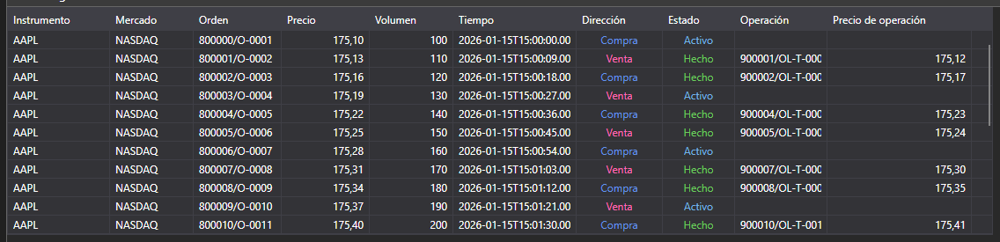

# Log de órdenes



[OrderLogGrid](xref:StockSharp.Xaml.OrderLogGrid) - componente gráfico para mostrar el log de órdenes ([OrderLogItem](xref:StockSharp.BusinessEntities.OrderLogItem)).

**Propiedades y métodos principales**

- [OrderLogGrid.LogItems](xref:StockSharp.Xaml.OrderLogGrid.LogItems) - lista de elementos del log de órdenes.
- [OrderLogGrid.SelectedLogItem](xref:StockSharp.Xaml.OrderLogGrid.SelectedLogItem) - elemento seleccionado del log de órdenes.
- [OrderLogGrid.SelectedLogItems](xref:StockSharp.Xaml.OrderLogGrid.SelectedLogItems) - elementos seleccionados del log de órdenes.

A continuación se muestran fragmentos de código que demuestran su uso:

```xaml
<Window x:Class="SampleITCH.OrdersLogWindow"
		xmlns="http://schemas.microsoft.com/winfx/2006/xaml/presentation"
		xmlns:x="http://schemas.microsoft.com/winfx/2006/xaml"
		xmlns:loc="clr-namespace:StockSharp.Localization;assembly=StockSharp.Localization"
		xmlns:xaml="http://schemas.stocksharp.com/xaml"
		Title="{x:Static loc:LocalizedStrings.OrderLog}" Height="750" Width="900">
	<xaml:OrderLogGrid x:Name="OrderLogGrid" x:FieldModifier="public" />
</Window>
```

```cs
public class OrderLogWindow
{
	private readonly Connector _connector;
	private readonly Security _security;
	private Subscription _orderLogSubscription;
	
	public OrderLogWindow(Connector connector, Security security)
	{
		InitializeComponent();
		
		_connector = connector;
		_security = security;
		
		// Suscribirse al evento de recepción de elementos del log de órdenes
		_connector.OrderLogItemReceived += OnOrderLogItemReceived;
		
		// Crear una suscripción al log de órdenes
		_orderLogSubscription = new Subscription(DataType.OrderLog, security);
		
		// Iniciar suscripción
		_connector.Subscribe(_orderLogSubscription);
	}
	
	// Manejador del evento de recepción de elementos del log de órdenes
	private void OnOrderLogItemReceived(Subscription subscription, OrderLogItem item)
	{
		// Comprobar si el elemento de log pertenece a nuestra suscripción
		if (subscription != _orderLogSubscription)
			return;
			
		// Agregar el elemento a OrderLogGrid en el hilo de la interfaz de usuario
		this.GuiAsync(() => OrderLogGrid.LogItems.Add(item));
	}
	
	// Método para cancelar la suscripción al cerrar la ventana
	public void Unsubscribe()
	{
		if (_orderLogSubscription != null)
		{
			_connector.OrderLogItemReceived -= OnOrderLogItemReceived;
			_connector.UnSubscribe(_orderLogSubscription);
			_orderLogSubscription = null;
		}
	}
}
```

### Filtrado del log de órdenes

```cs
// Crear una suscripción al log de órdenes con filtrado
public void SubscribeOrderLog(Security security, DateTime from, DateTime to)
{
	// Crear una suscripción al log de órdenes
	var orderLogSubscription = new Subscription(DataType.OrderLog, security)
	{
		MarketData =
		{
			// Especificar período de tiempo para datos históricos
			From = from,
			To = to
		}
	};
	
	// Suscribirse al evento de recepción de elementos del log de órdenes
	_connector.OrderLogItemReceived += OnFilteredOrderLogItemReceived;
	
	// Iniciar suscripción
	_connector.Subscribe(orderLogSubscription);
}

// Manejador del evento de recepción de elementos del log de órdenes con filtrado
private void OnFilteredOrderLogItemReceived(Subscription subscription, OrderLogItem item)
{
	// Comprobar tipo de suscripción
	if (subscription.DataType != DataType.OrderLog)
		return;
		
	// Filtrar por precio (ejemplo)
	if (item.Price < _minPrice || item.Price > _maxPrice)
		return;
		
	// Agregar el elemento a OrderLogGrid en el hilo de la interfaz de usuario
	this.GuiAsync(() => 
	{
		OrderLogGrid.LogItems.Add(item);
		
		// Limitar el número de elementos mostrados
		while (OrderLogGrid.LogItems.Count > _maxItems)
			OrderLogGrid.LogItems.RemoveAt(0);
	});
}
```

### Análisis de la dinámica del log de órdenes

```cs
// Clase para analizar la dinámica del log de órdenes
public class OrderLogAnalyzer
{
	private readonly Connector _connector;
	private readonly Security _security;
	private readonly OrderLogGrid _orderLogGrid;
	
	// Contadores para el análisis
	private int _buyCount = 0;
	private int _sellCount = 0;
	private decimal _buyVolume = 0;
	private decimal _sellVolume = 0;
	
	public OrderLogAnalyzer(Connector connector, Security security, OrderLogGrid orderLogGrid)
	{
		_connector = connector;
		_security = security;
		_orderLogGrid = orderLogGrid;
		
		// Suscribirse al evento de recepción de elementos del log de órdenes
		_connector.OrderLogItemReceived += OnOrderLogItemReceived;
		
		// Crear una suscripción al log de órdenes
		var subscription = new Subscription(DataType.OrderLog, security);
		
		// Iniciar suscripción
		_connector.Subscribe(subscription);
	}
	
	// Manejador del evento de recepción de elementos del log de órdenes
	private void OnOrderLogItemReceived(Subscription subscription, OrderLogItem item)
	{
		if (item.SecurityId != _security.ToSecurityId())
			return;
			
		// Analizar el elemento del log de órdenes
		if (item.Side == Sides.Buy)
		{
			_buyCount++;
			_buyVolume += item.Volume;
		}
		else if (item.Side == Sides.Sell)
		{
			_sellCount++;
			_sellVolume += item.Volume;
		}
		
		// Actualizar la interfaz con los resultados del análisis
		this.GuiAsync(() => 
		{
			// Agregar elemento a OrderLogGrid
			_orderLogGrid.LogItems.Add(item);
			
			// Actualizar estadísticas
			UpdateStatistics();
		});
	}
	
	// Actualizar estadísticas
	private void UpdateStatistics()
	{
		BuyCountLabel.Content = $"Compras: {_buyCount}";
		SellCountLabel.Content = $"Ventas: {_sellCount}";
		BuyVolumeLabel.Content = $"Volumen de compra: {_buyVolume}";
		SellVolumeLabel.Content = $"Volumen de venta: {_sellVolume}";
		
		// Calcular desequilibrio
		var volumeImbalance = _buyVolume - _sellVolume;
		var imbalancePercent = (_buyVolume + _sellVolume) > 0 
			? volumeImbalance / (_buyVolume + _sellVolume) * 100 
			: 0;
			
		ImbalanceLabel.Content = $"Desequilibrio: {volumeImbalance:F2} ({imbalancePercent:F2}%)";
	}
}
```

