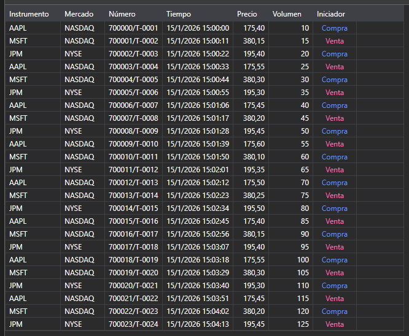

# Operaciones tick



[TradeGrid](xref:StockSharp.Xaml.TradeGrid) - tabla de operaciones.

**Propiedades principales**

- [TradeGrid.Trades](xref:StockSharp.Xaml.TradeGrid.Trades) - lista de operaciones.
- [TradeGrid.SelectedTrade](xref:StockSharp.Xaml.TradeGrid.SelectedTrade) - operación seleccionada.
- [TradeGrid.SelectedTrades](xref:StockSharp.Xaml.TradeGrid.SelectedTrades) - operaciones seleccionadas.

A continuación se muestran fragmentos de código que demuestran su uso:

```xaml
<Window x:Class="Sample.TradesWindow"
	xmlns="http://schemas.microsoft.com/winfx/2006/xaml/presentation"
	xmlns:x="http://schemas.microsoft.com/winfx/2006/xaml"
	xmlns:loc="clr-namespace:StockSharp.Localization;assembly=StockSharp.Localization"
	xmlns:xaml="http://schemas.stocksharp.com/xaml"
	Title="{x:Static loc:LocalizedStrings.Str985}" Height="284" Width="544">
	<xaml:TradeGrid x:Name="TradeGrid" x:FieldModifier="public" />
</Window>
```

```cs
public class TradesWindow
{
	private readonly Connector _connector;
	private readonly Security _security;
	private Subscription _tickSubscription;
	
	public TradesWindow(Connector connector, Security security)
	{
		InitializeComponent();
		
		_connector = connector;
		_security = security;
		
		// Suscribirse al evento de recepción de operaciones tick
		_connector.TickTradeReceived += OnTickReceived;
		
		// Crear una suscripción a operaciones tick
		_tickSubscription = new Subscription(DataType.Ticks, security);
		
		// Iniciar suscripción
		_connector.Subscribe(_tickSubscription);
	}
	
	// Manejador del evento de recepción de operaciones tick
	private void OnTickReceived(Subscription subscription, ITickTradeMessage tick)
	{
		// Comprobar si la operación pertenece a nuestra suscripción
		if (subscription != _tickSubscription)
			return;
			
		// Agregar la operación a TradeGrid en el hilo de la interfaz de usuario
		this.GuiAsync(() => TradeGrid.Trades.Add(tick));
	}
	
	// Método para cancelar la suscripción al cerrar la ventana
	public void Unsubscribe()
	{
		if (_tickSubscription != null)
		{
			_connector.TickTradeReceived -= OnTickReceived;
			_connector.UnSubscribe(_tickSubscription);
			_tickSubscription = null;
		}
	}
}
```

### Mostrar operaciones propias

```cs
public class MyTradesWindow
{
	private readonly Connector _connector;
	
	public MyTradesWindow(Connector connector)
	{
		InitializeComponent();
		
		_connector = connector;
		
		// Suscribirse al evento de recepción de operaciones propias
		_connector.OwnTradeReceived += OnOwnTradeReceived;
		
		// Crear una suscripción a datos de transacciones
		var myTradesSubscription = new Subscription(DataType.Transactions, null);
		
		// Iniciar suscripción
		_connector.Subscribe(myTradesSubscription);
	}
	
	// Manejador del evento de recepción de operaciones propias
	private void OnOwnTradeReceived(Subscription subscription, MyTrade myTrade)
	{
		// Agregar operación propia a TradeGrid en el hilo de la interfaz de usuario
		this.GuiAsync(() => TradeGrid.Trades.Add(myTrade));
	}
}
```

### Obtener operaciones tick históricas

```cs
// Método para obtener operaciones tick históricas
public void LoadHistoricalTicks(Security security, DateTime from, DateTime to)
{
	// Limpiar operaciones actuales
	TradeGrid.Trades.Clear();
	
	// Crear una suscripción a operaciones tick históricas
	var historySubscription = new Subscription(DataType.Ticks, security)
	{
		MarketData =
		{
			// Especificar período de tiempo para datos históricos
			From = from,
			To = to
		}
	};
	
	// Suscribirse al evento de recepción de operaciones tick
	_connector.TickTradeReceived += OnHistoricalTickReceived;
	
	// Iniciar suscripción
	_connector.Subscribe(historySubscription);
}

// Manejador del evento de recepción de operaciones tick históricas
private void OnHistoricalTickReceived(Subscription subscription, ITickTradeMessage tick)
{
	// Agregar tick a TradeGrid en el hilo de la interfaz de usuario
	this.GuiAsync(() => 
	{
		TradeGrid.Trades.Add(tick);
		
		// Actualizar estadísticas
		UpdateTradeStatistics();
	});
}

// Método para actualizar estadísticas de operaciones
private void UpdateTradeStatistics()
{
	int totalTrades = TradeGrid.Trades.Count;
	decimal totalVolume = TradeGrid.Trades.Sum(t => t.Volume);
	decimal averagePrice = TradeGrid.Trades.Any() 
		? TradeGrid.Trades.Average(t => t.Price)
		: 0;
	
	// Actualizar elementos de estadísticas de la interfaz
	TotalTradesLabel.Content = $"Total trades: {totalTrades}";
	TotalVolumeLabel.Content = $"Total volume: {totalVolume}";
	AveragePriceLabel.Content = $"Average price: {averagePrice:F2}";
}
```

### Filtrado de operaciones por volumen

```cs
// Método para filtrar operaciones por volumen mínimo
public void FilterTicksByVolume(decimal minVolume)
{
	// Guardar valor del filtro
	_minVolumeFilter = minVolume;
	
	// Actualizar manejador del evento de recepción de operaciones tick
	_connector.TickTradeReceived -= OnTickReceived;
	_connector.TickTradeReceived += OnFilteredTickReceived;
}

// Manejador del evento de recepción de operaciones tick con filtrado por volumen
private void OnFilteredTickReceived(Subscription subscription, ITickTradeMessage tick)
{
	// Comprobar si la operación pertenece al instrumento seleccionado
	if (tick.SecurityId != _security.ToSecurityId())
		return;
		
	// Aplicar filtro de volumen
	if (tick.Volume < _minVolumeFilter)
		return;
		
	// Agregar la operación a TradeGrid en el hilo de la interfaz de usuario
	this.GuiAsync(() => TradeGrid.Trades.Add(tick));
	
	// Si es una operación grande, puede resaltarla o enviar una notificación
	if (tick.Volume >= _largeVolumeThreshold)
	{
		NotifyLargeVolumeTrade(tick);
	}
}

// Método para notificar una operación grande
private void NotifyLargeVolumeTrade(ITickTradeMessage tick)
{
	// Mostrar información sobre la operación grande
	Console.WriteLine($"Large trade: {tick.SecurityId}, {tick.ServerTime}, Price: {tick.Price}, Volume: {tick.Volume}");
	
	// Puede agregar una notificación sonora o visual
	this.GuiAsync(() => 
	{
		// Ejemplo de resaltado visual en la lista
		var tradeItem = TradeGrid.Trades.LastOrDefault();
		if (tradeItem != null)
		{
			TradeGrid.SelectedTrade = tradeItem;
			HighlightTrade(tradeItem);
		}
	});
}
```

